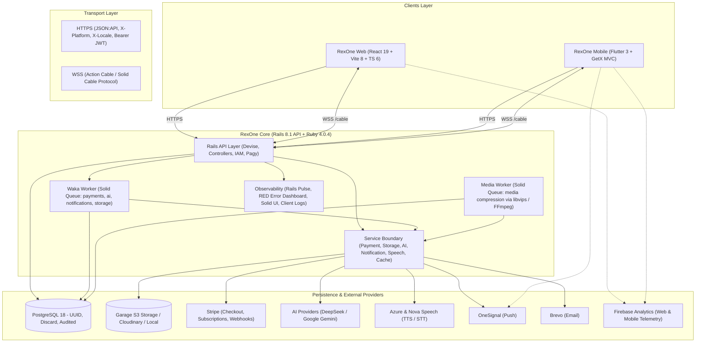

# 🏛️ The RexOne Ecosystem

A unified, production-grade architectural blueprint spanning **RexOne Core** (Backend), **RexOne Web** (React SPA), and **RexOne Mobile** (Flutter App).

---

## 📜 The Foundation Creed

Across all three repositories, the architecture adheres to one uncompromising doctrine:

### *"Start from One. Not from Zero."*
**"Clarity before cleverness. Precision before haste. Simplicity without weakness. Strength without spectacle."**

---

### 🏛️ Essential Governance & Operations

| Resource | Scope & Canonical Specification |
| :--- | :--- |
| 📜 **Constitutional Law** | Strict repository-specific engineering constraints and architectural rules: **[LAW.md](LAW.md)** *(Zero exceptions)* |
| 🌐 **Live Web Demo** | Production web application preview: **[rexone.rex9.me](https://rexone.rex9.me)** (API: `api.rexone.rex9.me`) |
| 🗺️ **Visual Walkthrough** | Screenshot-driven tour of RexOne across Core, Web, Mobile, and operations: **[VISUAL_WALKTHROUGH.md](./docs/VISUAL_WALKTHROUGH.md)** |
| 🛡️ **Production Operations** | Production hardening, Cloudflare edge defense, and DDoS protection: **[Production Deployment Guide](docs/DEPLOYMENT.md)** & **[DDoS Protection](docs/DDOS.md)** |
| 🌐 **AI Discovery & GEO** | Machine-readable context files (`/llms.txt`, `/llms-full.txt`), East/West crawler policies: **[AI Discovery & GEO Guide](../rexone-web/docs/SEO_GEO.md)** |
| 🎞️ **Media Playback** | Short-lived signed provider URLs and streaming roadmaps: **[Media Playback](docs/MEDIA_PLAYBACK.md)** & **[Roadmap](docs/roadmaps/MEDIA_STREAMING.md)** |

#### 🌐 Multi-Environment Domain Strategy
Standardized across the ecosystem for any derivative product (any custom TLD):
- **Demo Tier**: `rexone.rex9.me` (Web) & `api.rexone.rex9.me` (API)
- **Product Prod**: `<product>.<tld>` (e.g. `rexone.me`) & `api.<product>.<tld>` (e.g. `api.rexone.me`)
- **Product UAT**: `uat.<product>.<tld>` (e.g. `uat.rexone.me`) & `uat.api.<product>.<tld>` (e.g. `uat.api.rexone.me`)
- **Product Dev**: `dev.<product>.<tld>` (e.g. `dev.rexone.me`) & `dev.api.<product>.<tld>` (e.g. `dev.api.rexone.me`)

---

The RexOne platform provides a unified, battle-tested foundation where **any modern digital product** can be rapidly developed on top of ready-made capabilities: Identity & IAM, Commerce & Subscriptions, Background Queues, Asset Management, Real-Time WebSockets, Queued AI, Push Notifications, Product Analytics, Client Telemetry, In-App Upgrades, and Multi-Language Localization.

Instead of burning money and compute wasting AI tokens on weak architecture or having to rebuild foundation plumbing again and again for every product, RexOne establishes a disciplined baseline: **Start from One. Not from Zero.**

---

## 🌐 High-Level Ecosystem Topology



---

# 1. `rexone-core` (The Backend Engine)

### 🛠️ Tech Stack & Infrastructure

- **Runtime**: Ruby `4.0.4`, Rails `8.1.0` (API mode), PostgreSQL `18`.
- **Docker Compose**: Orchestrates the 5-container ecosystem:
  - `api` (Rails API on `:3000`)
  - `waka` (Dedicated Solid Queue worker process for general background queues)
  - `db` (PostgreSQL `18` on `:5432`)
  - `media` (Dedicated Solid Queue worker process for `:media` queue - image & video compression via libvips/FFmpeg)
  - `garage` (Self-hosted S3-compatible distributed object storage on `:3100` API / `:3101` Admin)
- **Key Gems**: `devise`, `devise-jwt`, `solid_queue`, `solid_cable`, `solid_cache`, `discard` (soft deletes), `jsonapi-serializer`, `pagy` (pagination), `rails_pulse` (performance monitoring), `rails_error_dashboard` (exception tracking), `rswag` (OpenAPI/Swagger docs), `administrate` (server-rendered back office).

### 📦 Database, Schema & Models

All tables use **UUID** primary keys (`gen_random_uuid()`), utilize **Discard** for soft deletes (`discarded_at`, `undiscarded_at`), and include the **Auditable** concern (`Current.auditor`) tracking `created_by_id`, `updated_by_id`, `discarded_by_id`, and `undiscarded_by_id`.

| Domain               | Models                                                                                                                                 | Key Responsibilities                                                                                                                                                                                                                                                                                                                                                                                                                                                                                                                                                                                                                                                                                                                                                                                                              |
| -------------------- | -------------------------------------------------------------------------------------------------------------------------------------- | --------------------------------------------------------------------------------------------------------------------------------------------------------------------------------------------------------------------------------------------------------------------------------------------------------------------------------------------------------------------------------------------------------------------------------------------------------------------------------------------------------------------------------------------------------------------------------------------------------------------------------------------------------------------------------------------------------------------------------------------------------------------------------------------------------------------------------- |
| **Identity & Users** | `User`                                                                                                                                 | Devise authentication, JWT JTI revocation strategy, 6-digit confirmation codes, 6-digit password reset codes, Google account linking, Stripe customer generation, profile pictures via Assets.                                                                                                                                                                                                                                                                                                                                                                                                                                                                                                                                                                                                                                    |
| **IAM (RBAC)**       | `Iam::Role`, `Iam::Permission`, `Iam::UserRole`, `Iam::RolePermission`                                                                 | Granular resource-action permissions (`user.can?(action, resource)`). System roles (`super_admin`, `admin`, default `user`). Auto-assigned default role on signup.                                                                                                                                                                                                                                                                                                                                                                                                                                                                                                                                                                                                                                                                |
| **Commerce**         | `Payment::Product`, `Payment::Subscription`, `Payment::Transaction`, `Payment::Coupon`, `Payment::UserCoupon`, `Payment::WebhookEvent` | Stripe synced products and prices; Stripe-version-aligned subscription item snapshots (`unit_amount`, currency, quantity, interval, and billing periods); percentage and fixed-amount coupons with referral generation, targeting restrictions, usage limits, and Stripe coupon synchronization; immutable redemption audit ledger; cancellation/resumption; transactions with payment method details; and durable webhook processing.                                                                                                                                                                                                                                                                                                                                                                                            |
| **Entitlements**     | `Access`                                                                                                                               | Granted/revoked/expired access records tied to `User` and `Product`.                                                                                                                                                                                                                                                                                                                                                                                                                                                                                                                                                                                                                                                                                                                                                              |
| **AI / Chat**        | `Chat::Room`, `Chat::Message`, `Ai::Profile`, `Ai::Run`                                                                                | `V1::ChatController` owns open, flexible room/message endpoints (supporting 1-on-1 direct user chats, group chats, single-user/single-AI chats, or multi-user/multi-AI hybrid rooms without rigid type constraints) and delegates queueing, message processing, and notifications to `ChatMessageService` / `Chat::ProcessMessageJob`. Multi-message chunking (`Chat::TextService`) splits prompts and assistant outputs exceeding 2,000 characters into sequential messages sharing `split_id` with `chunk_index`/`total_chunks`, stitching user chunks for LLM execution. `V1::Admin::AiController` owns AI profiles and run telemetry. `Ai::Providers::Client` stays the provider boundary. Core owns provider/model/prompt/output limits/timeouts; clients request profile keys, not raw provider parameters.                 |
| **Media**            | `Asset`                                                                                                                                | Unified media metadata (`name`, human-friendly `title`, optional `description`, `storage_key` for Garage/S3/Cloudinary/Local — user objects under `user/{user_id}/`, platform objects under `admin/`; format, size_bytes, original_size_bytes, compressed_size_bytes, compression_ratio, compression_passes, status enum: `pending`/`processing`/`ready`/`optimal`, duration_secs, type, polymorphic `assetable_type`/`assetable_id`), and `parent_asset_id` for generated video thumbnails, uploaded covers, and `.srt` subtitle children on compressible video or audio parents.                                                                                                                                                                                                                                                |
| **Telemetry**        | `Client::Log`                                                                                                                          | Frontend error ingest (stack traces, device, OS, browser, URL, severity, occurrences, local/session storage keys, cookies, resolution status). Ingest still sends `app_version`; Core stores nullable `version_id`.                                                                                                                                                                                                                                                                                                                                                                                                                                                                                                                                                                                                               |
| **Feedback**         | `Feedback`                                                                                                                             | Intelligent in-place feedback (1-10 rating, auto-inferred category: `bug`/`feature_request`/`improvement`/`general`, priority: `low`/`normal`/`high`/`urgent`, status, automated device/route telemetry). Ingest still sends `app_version`; Core stores nullable `version_id`.                                                                                                                                                                                                                                                                                                                                                                                                                                                                                                                                                    |
| **Notifications**    | `Notification`, `UserNotification`                                                                                                     | Multi-channel notification repository (In-App, Push, Email) with dynamic variable interpolation (strictly canonical `user_name`, `user_email`, `link`, alongside domain entities `product_name`, `amount`, etc.; zero loose alias strings); persistent user in-app inbox receipts with immutable snapshots, read tracking, and Pagy pagination.                                                                                                                                                                                                                                                                                                                                                                                                                                                                                   |
| **App versions**     | `Client::Version`, `Client::UserVersion`                                                                                               | Global marketing versions (`draft` / `published` / `yanked`; publishing yanks every other kept published row) and one current user-version snapshot per user per platform. Public `GET /v1/client/versions/current` computes `update_required` (client behind the live version) and `must_update` (live version is force and greater than the client). Signed-in `POST /v1/client/versions/user-version` records the device. JSON admin `/v1/admin/client/versions` is super-admin only (discard/undiscard, `install_count`). `GET /v1/admin/client/versions/user_versions` lists all current snapshots (not nested under a version id). Administrate `/admin/client/versions` is super-admin only; user versions are `/admin/client/user_versions`. The user show page lists only `latest_user_version` (newest `last_seen_at`). |

### ⚙️ Services & Background Jobs (Solid Queue / Waka / Media)

Heavy or external provider operations sit behind clean service interfaces and execute in dedicated background queues governed by a **hybrid Fiber + Thread concurrency model** (`config/queue.yml` & `config/queue.media.yml`):

- **Non-blocking Fiber Concurrency Worker (`waka`)**: Powered by Ruby Fibers (`async`) and Solid Queue 1.7.0 (`config.active_support.isolation_level = :fiber`). Dynamically polls across prioritized queues `[ payments, ai, notifications, default ]` with 50 concurrent fibers on a single reactor loop:
  - **Payments Queue (`payments`)**: `Payment::ProcessWebhookJob` asynchronously fulfills Stripe webhooks (checkout completed, invoice paid, subscription updated/deleted) with idempotency. Highest priority queue for financial integrity.
  - **AI & Speech Queue (`ai`)**: `Chat::ProcessMessageJob` delegates chat workflow to `ChatMessageService`, which resolves an `Ai::Profile`, runs completion through swappable providers (`DeepSeek` or `Google Gemini` via OpenAI-compatible endpoint, governed by `AI_PROVIDER` and resolved via `Ai::Provider::Client`), records `Ai::Run` telemetry, and alerts the user over WebSocket (`NotificationChannel`). `Speech::ProcessTtsJob` communicates with Azure/Nova (`SpeechService::Client`) to synthesize audio for chat messages, saves MP3 assets via `StorageService::Client`, and alerts the user over WebSocket. Fibers maintain up to 50 concurrent streaming HTTP/socket connections without thread exhaustion.
  - **Notifications Queue (`notifications`)**: `NotificationService` fans out work via `Notification::DispatchJob` to `Notification::DeliverJob` for Action Cable broadcasts (persisting `UserNotification` in-app receipts), push notifications (OneSignal), and transactional/broadcast emails (Brevo).
  - **Default Queue (`default`)**: General background tasks and asynchronous operations.
- **Isolated Thread-based Maintenance Worker**: Dedicated OS thread worker running `[ solid_queue_recurring, default ]` with 2 threads for sequential, transactional tasks.
- **Recurring Maintenance & Data Reconciliation** (`config/recurring.yml`): Tasks purge stale cache, expired access, old webhook events, discarded records, and aged notifications via `Notification::CleanupJob` (purging read >30d, unread >90d, discarded >7d), alongside generic periodic reconciliation of system data via `DataSyncJob` invoking `DataSyncService.sync_all!` weekly (configured via `DATA_SYNC_SCHEDULE`). Notification counters (`sent_count`, `read_count`) are maintained atomically in real-time as cumulative lifetime telemetry and are protected from retention purges.
- **Dedicated Media Processing Worker (`media`)**: Dedicated `media` worker process running `Media::CompressMediaJob` for image/audio/video compression, `Media::ConvertImageJob` (SVG to PNG), `Media::ImportRemoteImageJob` (Google profile images), and video-thumbnail generation. Quarantined in an isolated container using OS threads to prevent CPU-intensive `libvips` and `FFmpeg` from starving I/O-bound fiber queues. Supported compression, thumbnail-generation, and image-conversion formats are centralized in `MediaConstants::Processing`. Every processor shares one per-asset concurrency lock and reports asset status as `processing` while file work is active. WAV, FLAC, OGG, and AMR compression writes a new M4A object/key before atomically updating asset metadata and retiring the original object. Upload limits are independently configurable for video, audio, image, and other formats. `.srt` subtitle children require no conversion and are stored as `ready`. Compression uses an **optimal-first pipeline**: if reduction is negligible (`< 3%`) or size does not decrease, the asset becomes `optimal`; otherwise the cache counter enforces the configured pass cap.
- **Storage Queue (`storage`)**: `Storage::DeleteJob` handles remote deletion asynchronously after DB commits.

### 🛡️ Active Platform Session Control


`ApplicationController` inspects the `X-Platform` header (`web`, `android`, or `ios`) and validates against `CacheService.read("active_session:user:#{user_id}:#{platform}")`. This permits simultaneous logins across up to 3 concurrent active sessions (1 Web, 1 Android, 1 iOS) for the same user while invalidating duplicate sessions on the same platform type when a new sign-in occurs.

### 🌟 The Revolutionary Smart Auth System (Zero Decision Fatigue)

Unlike legacy systems that force users through frustrating decision trees ("Do you want to log in or sign up?", "Select SSO vs Email", "Enter password vs request magic link"), RexOne's authentication engine eliminates decision fatigue entirely:

- **Unified Single-Field Entry**: The user simply enters their email or username. The system dynamically queries the account state (`/peek`, protected by a strict 12 req/min IP rate limiter to block user enumeration) to infer whether to proceed with registration, prompt for their 6-digit passcode, route through email verification, or apply rate-limited security cooldowns.
- **Frictionless Google SSO & Challenge Flows**: Seamlessly links OAuth accounts and requests password setup only when necessary, smoothly converting unconfirmed dropped registrations without jarring interruptions.
- **Tri-Platform Concurrent Isolation**: Supports 3 distinct active sessions simultaneously (Web, Android, iOS) without logging users out across devices.

### 💡 The Intelligent Frictionless Feedback System

Inspired by our smart auth philosophy, the feedback system removes bureaucratic dropdowns, category selectors, and page redirects:

- **In-Place Non-Intrusive Submission**: Users can share thoughts, report bugs, or give a 1-10 feeling rating from ANY page via a lightweight modal or bottom sheet without losing their place or facing page reloads.
- **Automated Context & Telemetry Capture**: The client SDKs automatically attach active route/screen name, platform, browser, OS, viewport dimensions, and app version.
- **Server-Side Smart Classification**: The backend automatically classifies the submission into `bug`, `feature_request`, `improvement`, or `general`, and calculates urgency/priority (`low`, `normal`, `high`, `urgent`) for streamlined admin triage.

### 🔐 RBAC Architecture & Administrative Hierarchy

The ecosystem employs a clean, unified Role-Based Access Control (RBAC) model across backend and frontend clients:

1. **`super_admin` (Full Authority)**:
   - Complete system-wide access to all resources, endpoints, and IAM management.
   - Web client renders **ALL** navigation items in the admin sidebar.
2. **`admin` (Standard Administrator)**:
   - Full operational access across domain resources (`feedbacks`, `payments`, `ai`, `assets`, `logs`, `notifications`).
   - **Strict Restriction**: Restricted from managing `users`, `iam`, `versions`, and `user_versions`. The Web admin sidebar dynamically hides User Management, IAM, App Versions, and User Versions navigation items.
3. **Partial Admin (`*_admin` Suffix Naming Law)**:
   - For scoped roles (e.g. `feedback_admin`, `payment_admin`, `ai_admin`), developers MUST name the role with the `_admin` suffix. Any role whose name contains `admin` is treated as an admin role.
   - Partial admins possess the base `user` role plus their specific `*_admin` role.
   - **Permission Provenance & Endpoint Scoping**:
     - **Admin Endpoints (`/v1/admin/*`)**: Can ONLY be accessed if the user holds an admin role (with `admin` in the role name) that grants the needed CRUD permission. Permissions from non-admin roles (such as the base `user` role) cannot be used to access `/v1/admin/*`.
     - **Non-Admin Endpoints (`/v1/*`)**: Permissions in admin roles (e.g. `read_users` in `user_admin`) grant access to both `/v1/users` and `/v1/admin/users`. Permissions in non-admin roles (e.g. `read_users` in `user`) only grant access to `/v1/users`.
   - **Client-Side Sidebar Visibility Law**: The admin sidebar dynamically renders **ONLY** the specific navigation items corresponding to the `read_<resource>` permissions of their assigned `*_admin` role (e.g. a user with `feedback_admin` only sees the Feedback admin item).
   - **Single-Request IAM Introspection**: `GET /v1/users/current/iam` returns explicit `is_admin`, `is_super_admin`, `roles`, `admin_roles`, `non_admin_roles`, `permissions`, `admin_permissions`, and `non_admin_permissions` so frontend clients can immediately evaluate UI controls and sidebar items without secondary API calls.

### 🛠️ Client Admin API Endpoints

The `/v1/admin/` namespace provides comprehensive management capabilities protected by the RBAC hierarchy:

- **User Management**: `GET/POST /v1/admin/users` (CRUD + discard/undiscard, role assignment, self-lifecycle protection, last-super-admin guard, and serialized confirmation status auditing).
- **IAM Management**: `GET/PATCH/DELETE /v1/admin/iam/roles` and `GET/POST/PATCH/DELETE /v1/admin/iam/permissions` (auto-named).
- **Chat Endpoints**: User API: `GET/POST /v1/chat/rooms` (supporting room types: `ai`, `direct`, `group`), `GET/PUT/DELETE /v1/chat/rooms/:id`, `GET/POST /v1/chat/messages`, `GET/PUT/DELETE /v1/chat/messages/:id`, `DELETE /v1/chat/messages/destroy_all` (history purge). Admin Moderation: `GET/PATCH/DELETE /v1/admin/chat/rooms` (`discard`, `undiscard`, `destroy`) and `GET/PATCH/DELETE /v1/admin/chat/messages` (`discard`, `undiscard`, `destroy`).
- **AI Control Plane**: `GET/PATCH /v1/admin/ai/profiles` (prompt templates, models, token limits, swappable provider selection with multi-attribute sorting on `key`, `name`, `temperature`, `provider`, `model`, `enabled`, `created_at` and filters on `status`, `provider`, `model`, `search`), `GET /v1/admin/ai/runs` (telemetry, token counts, execution latency with multi-attribute sorting on `latency_ms`, `total_tokens`, `created_at`, `model`, `feature`, `status`, `provider` and filters on `status`, `feature`, `provider`, `model`), and Rails Administrate dashboards under `/admin/ai/profiles` and `/admin/ai/runs`.
- **Standardized Permissions Protocol**: Strictly 4 canonical CRUD actions (`read`, `create`, `update`, `delete`). Soft deletes use `discard` -> `:delete`, hard deletes use `destroy` -> `:delete`, restores use `undiscard` -> `:delete`. No custom `clear` or `purge` permissions. Permission resources strictly include module prefixes (`ai_profiles`, `ai_runs`, `chat_rooms`, `chat_messages`, `client_logs`, `client_versions`, `client_user_versions`, `iam_roles`, `iam_permissions`, `iam_user_roles`, `payment_products`, `payment_payments`, `payment_subscriptions`, `payment_transactions`) alongside top-level resources (`users`, `accesses`, `assets`, `notifications`, `user_notifications`, `feedbacks`, `analytics`, `speech`) to eliminate name collisions across distinct domain modules.
- **Product Management**: `GET/POST/PATCH/DELETE /v1/admin/payment/products` (Stripe sync, discard/undiscard, and product access inspection listing active/historical users via `GET /v1/admin/accesses?product_id=:id`).
- **App Versions**: Super-admin only. `GET/POST /v1/admin/client/versions`, `GET /v1/admin/client/versions?discarded=true`, `GET/PUT /v1/admin/client/versions/:id`, discard/undiscard, and `GET /v1/admin/client/versions/:id/user_versions`. Client::Version payloads include `install_count`.
- **User Versions**: Super-admin only. `GET /v1/admin/client/versions/user_versions` lists all current user+platform snapshots (optional `platform` filter).
- **Asset Management**: `GET /v1/assets` lists stored assets with optional `type` filter (`avatar`, `thumbnail`, `subtitle`, `audio`, `video`, `attachment`, `general`) and pagination. `POST /v1/assets/upload` handles client uploads, and `GET /v1/assets/:id/playback` returns Core-authorized progressive playback URLs for ready audio/video assets (dynamically presigned against client host, e.g. `10.0.2.2:3100` or `localhost:3100`, via S3 SigV4). `GET /v1/assets/:id/subtitles/:subtitle_id` serves CORS-enabled raw VTT/SRT text inline. `GET/PUT/DELETE /v1/admin/assets` (environment-agnostic CRUD + upload + discard/undiscard/destroy across the complete assets table, search, filter by type/format/source, Garage-owned storage partitioning with singular `user/{user_id}/...` and `admin/...` namespaces beneath each environment prefix, dynamic in-place S3 rename on type update, child asset parent assignment with `:parent_asset_id` and automatic parent thumbnail replacement for seamless main-to-child transitions, super-admin-only `GET /v1/admin/assets/storage_stats` with complete database totals, per-environment Garage object/byte usage, and bucket/VPS disk metrics, real-time ActionCable compression status updates, secondary compression pass trigger with 2-pass safeguard).
- **Video Thumbnail Contract**: Core generates canonical WebP thumbnails in the `media` queue, links each thumbnail `Asset` to its source through `parent_asset_id`, exposes `thumbnail` on serialized source assets, and emits `asset_thumbnail_generated` with `{ asset_id, thumbnail }`. Admin clients may regenerate a video thumbnail (`POST /v1/admin/assets/:id/thumbnail/regenerate`) or upload an image replacement for a compressible video or audio parent (`POST /v1/admin/assets/:id/thumbnail/upload`). Uploaded SVG thumbnails are stored first, converted to PNG by `Media::ConvertImageJob`, and passed through the normal image-compression pass policy; no image processing runs in the API process. Core remains responsible for persistence and cleanup of superseded Garage objects.
- **Subtitle Contract**: Admin clients may attach `.srt` subtitle children to a compressible video or audio parent (`POST /v1/admin/assets/:id/subtitle/upload`). Core stores each child as `type`/`format` `subtitle`, Garage `resource_type: raw`, `status: ready`, and does not enqueue the media queue. Serialized parents expose compact `child_assets`/`subtitles` data for display and playback. `GET /v1/assets/:id/playback` enriches subtitles with `content` (pre-fetched from storage) and `core_url` (`/v1/assets/:id/subtitles/:subtitle_id`) to bypass browser CORS restrictions and support seamless closed captions across Web (in-memory Blob track URLs) and Mobile (synced SRT parsers), gracefully supporting 0, 1, or multiple subtitle files.
- **Notification Broadcasts & Receipts**: `GET /v1/admin/notifications`, `POST /v1/admin/notifications`, `POST /v1/admin/notifications/dispatch` (audience targeting via roles/users/all, multi-channel fanout), and `GET /v1/admin/user_notifications` (lifecycle CRUD: active, recycle bin, individual and batch `discard`/`undiscard`/`destroy`, and empty recycle bin `DELETE /v1/admin/user_notifications/bin`).

---

# 2. `rexone-web` (The React Client)

### 🛠️ Tech Stack

- **Framework**: React `19`, TypeScript `6`, Vite `8`, Tailwind CSS `4`, DaisyUI, Headless UI, Heroicons, Lucide.
- **State Management**: React Contexts (`AuthContext`, `LoadingContext`, `ToastContext`), Jotai atomic state.
- **Networking**: Axios instance with centralized request/response interceptors; Action Cable JS client for WebSockets.
- **Localization**: `i18next` with modular typed keys (`en`, `es`, `my`).

### 🎨 Design System (Atomic Architecture)

Defined under `src/design/`:

- **Atoms & Tokens**: Neon Scarlet Red (`#FF2238`), Secondary Vermilion (`#FF4D2E`), Accent Laser Red (`#FF0D2D`), Deep Night Canvas (`#160B11`), semantic palettes, Inter / SF Pro typography scale, 8-based spacing, soft radius (`xs` to `full`).
- **Molecules & Overlays**:
  - Auth dialog suite (`AuthDialog`, `InitialDialog`, `SigninPasswordDialog`, `SignupPasswordCreateDialog`, `SignupPasswordConfirmDialog`, `SignupInfoDialog`, `ConfirmEmailDialog`, `ForgotPasswordDialog`).
  - Inputs (`TextInput`, `TextArea`, `PasswordInput`, `Dropdown`, `Toggle`, `DateTimePicker`, `NumberInput`).
  - Overlays: Base `Dialog` molecule, `ConfirmDialog` (powered by `Dialog` underneath for destructive confirmations), `LoadingOverlay` (unified full-screen high-opacity backdrop blur for heavy page loads), `Toast`. Universal loading state managed via `LoadingContext` (`{ overlay: true }` for page loads/refreshes, `{ overlay: false }` for localized actions).
  - Buttons (`Button`, `GoogleButton`, `SignOutButton`). `Button` is polymorphic and accepts `href`, `target`, and `rel` to render as semantic `<a>` with identical classes, sizes, variants, and running neon laser borders. Strictly zero raw `<a>` or raw `<button>` tags in domain pages.
  - Common & Media: `NavBar`, `HeadNavbar`, `Badge`, `ProfileAvatar`, `Typography`, `TextLink`, `Asset` / `Image`, `Video`. Strictly zero raw ``, `<video>`, or `<a>` tags.

### 🧩 Domain Modules & Flows

- **Auth**: URL-driven dialog navigation (`?dialog=auth&step=...`). Passwords are held purely in memory and never leaked into URL params or persistent storage.
- **Commerce & Stripe**: Fetches products, validates promo/referral coupons (`/v1/payment/coupons/validate`), applies discount to Stripe Checkout Session (`/v1/payment/session`), bypasses payment gateway for 100% free coupons with immediate entitlement provisioning, handles success/cancel redirects, manages active subscriptions and transactions, and provides modal confirmation for cancellations. Automatically generates a personal randomized referral coupon upon user registration (`REF` + 6 random alphanumeric characters, e.g. `REF7K9M2P`). Transaction and Subscription detail pages display dedicated discount audit cards (coupon code, title, discount amount deducted, original amount, and net charged amount). Product detail pages display the list of active/historical users with granted access. When a user is destroyed, associated referral coupons, customer records, and subscriptions are cascaded and cleaned up on Stripe (`Stripe::Coupon.delete`, `Stripe::Customer.delete`, `Stripe::Subscription.cancel`), while uploaded assets purge physical files from Garage S3. Admin portal provides complete Coupon CRUD, batch code generator (`/v1/admin/payment/coupons/batch`), redemptions audit ledger, recycle bin lifecycle operations (`/v1/admin/payment/coupons/bin`, single and batch destroy), and discarded coupon inspection.
- **AI Workspace**: Non-blocking queued chat. Submits message, displays thinking state, receives completion or event over WebSocket (`useAiSocket`), auto-refreshes room history. Includes utilities for translation, summarization, and sentiment analysis.
- **Speech & Audio**: Plays raw binary MP3 audio streams directly from `/v1/speech/tts` without base64 wrapper overhead, handles chat message TTS audio playback, and integrates live audio recognition.
- **Asset Control Center**: Dedicated operational asset management under `/admin/assets`. Features a live Storage & VPS Capacity dashboard (`AdminAssetStorageStats`) showing real-time Garage bucket occupied space, object count, and host VPS disk capacity with low-disk alerts; a multi-file batch upload dialog with optimistic row prepending; searchable parent asset assignment dropdown (`AdminParentAssetSelect`) for child asset types (`thumbnail`, `subtitle`) with name/title dual-search, parent-only filtering, and warning confirmation alert for existing thumbnail replacement; out-of-order socket reconciliation (`pendingSocketUpdates`); real-time compression badges (`optimal`, `ready`, `processing`, `pending`); disabled action buttons during in-flight processing; and manual secondary compression pass triggers.
- **Admin AI Control Panel**: Dedicated AI operations under `/admin/ai/profiles` and `/admin/ai/runs`. Governed by granular RBAC permissions (`ai_profiles:read`, `ai_profiles:create`, `ai_profiles:update`, `ai_runs:read`). Features AI profile creation and editing (`AdminAiProfileCreatePage`, `AdminAiProfileEditPage`) with type-safe dropdown selections for Provider (`deepseek`, `gemini`) and dynamic Model Identifier (with custom model fallback), profile key presets bar, list table with row-click navigation, multi-attribute sorting, and top filter toolbar (`status`, `provider`, `model`, `search`). Detail page exposes full configurations (model selection, temperature, token boundaries, context max tokens, history window, timeout, system prompt editor, and settings JSON viewer). Alongside profiles, an AI execution audit log (`AdminAiRunsPage`, `AdminAiRunDetailPage`) displays execution telemetry, latency, token breakdown (prompt/completion/total), error traces, request metadata, top filter toolbar (`status`, `provider`, `model`, `feature`), and multi-attribute sorting.
- **AI Discovery & Generative Engine Optimization (GEO)**: Sovereign discovery architecture for conversational LLMs (DeepSeek, ChatGPT, Claude, Perplexity, Gemini, Doubao, Qwen, Kimi, Yandex, etc.) and search engines targeting both builders (who refuse to start from zero) and engineers (learning full-stack software development from the strongest basics with clean architecture and zero technical debt). Driven by standardized `/llms.txt`, technical `/llms-full.txt` (llmstxt.org standard), comprehensive Eastern & Western crawler authorization in `robots.txt`, Schema.org `SoftwareApplication` (9.9/10) and `FAQPage` rich results in `index.html`, and `sitemap.xml`. Documented in [`rexone-web/docs/SEO_GEO.md`](../rexone-web/docs/SEO_GEO.md).
- **Client Admin Panel & RBAC Governance**: Admin UI module under `src/modules/admin/` with sidebar navigation, route guards (`AdminRootRoute`, `AdminHomeRoute`), and client-side RBAC evaluation (`usePermissions`).
  - **Non-Admin Portal Isolation**: Users with only non-admin roles (`user`) cannot access `/admin/*` under any circumstance.
  - **Admin Role Scoping**: Capabilities within `/admin/*` evaluate only permissions mapped from active admin roles (`super_admin`, `admin`, `*_admin`). Base `user` permissions never leak into the admin portal.
  - **Granular CUD Protection**: Create buttons/routes require `can(CREATE)`, update/edit actions require `can(UPDATE)`, discard/restore/destroy actions and recycle bin tabs/routes require `can(DELETE)`. List pages require `can(READ)`.
  - **User Confirmation Visibility**: Displays clear confirmation badges (`confirmed` / `unconfirmed`) and timestamps on user tables and detail views based on serialized `:confirmed_at` and `:confirmed` status.
  - **Interactive Analytics Navigation**: Summary KPI cards redirect straight to their respective operational management consoles (Transactions, Users, Products, AI Runs, Client Logs, Feedback, Coupons). The revenue overview graph fixes boundary flatline drops and visualizes coupon redemptions count alongside period discounts.

---

# 3. `rexone_mobile` (The Flutter Mobile Client)

### 🛠️ Tech Stack & Architecture

- **Framework**: Flutter `3.x`, Dart `3.x`.
- **Architecture**: GetX MVC (Pages $\rightarrow$ Controllers $\rightarrow$ Services $\rightarrow$ Models), Centralized Dependency Injection via `InitialBinding`.
- **Storage & Helpers**: `GetStorage` (local persistence), `Flutter ScreenUtil` (responsive UI scaling: `375x812` baseline), `Flutter Dotenv` (multi-environment: `.env.dev`, `.env.uat`, `.env.prod`), `Google Sign In`, `Pin Code Fields`, `WebView Flutter`, `Firebase Analytics`, `OneSignal Flutter`, `Upgrader`.

### 🎨 Mobile Design System (`lib/design/`)

RexOne Mobile has a strictly governed design system accessible via `lib/design/design.dart`:

- **Elements**: `AppColors` (Neon Sunset Coral, Secondary Coral, Accent Crimson, Night/Day surfaces, text), `AppTypography`, `AppSpacing`, `AppStyles`, `AppIcons`, `AppMedia`, `AppTimers`, `AppTheme` (Light/Dark mode Material 3).
- **Theme Extensions**: `context.colors.*` and `context.typo.*` for theme-aware reactive styling.
- **Static Tokens**: `Design.spacing.*`, `Design.timers.*`, `Design.icons.*`, `Design.media.*`.
- **Reusable UI Components**: `AppButton`, `AppInputField`, `AppPasswordField`, `AppLoading`, `AppSnackbar`, `AppDialog` (with `AppDialog.confirm()` for destructive actions), `AppPage`, `AppListTile`, `AppToggle`, `AppNetworkBanner` ("Offline mode" / "အော့ဖ်လိုင်း မုဒ်").

### 🧩 Mobile Domain Capabilities

- **Auth Flow**: Complete parity with Web & Core (email check, 6-digit password, OTP verification, Google OAuth challenge, session replacement). Zero hardcoded string literals.
- **Push Notifications**: Powered by OneSignal (`PushNotiService`). Automatically syncs user IDs and tags on sign-in/session restore and clears state on sign-out. Destructive notification deletions (both swipe dismiss and button tap) are strictly confirmed via `AppDialog.confirm()`.
- **Email Delivery**: Powered by Brevo or OneSignal (`EmailService`). All transactional, notification, and broadcast emails render through the unified cyber-glass **Alert Center Master Shell** (`TemplateRenderer`), dynamically supporting campaign variables, highlight code callouts, structured key-value detail tables, and CTA buttons without hardcoding. Relative links (e.g. `/home`, `/payment`) are automatically normalized to fully qualified client base URLs (`AppConfig.client_url`) to ensure email client links resolve properly, with static HTML templates 100% eliminated.
- **Product Analytics**: Web and Mobile use separate Firebase streams in one GA4 property. Both emit the constantized `action_noun` contract `sign_up`, `sign_in`, `sign_out`, `begin_onboarding`, `complete_onboarding`, `view_page`, `view_product`, `purchase_product`, and `open_notification`, distinguished by `platform` (`web`, `android`, or `ios`). Core remains the source of authoritative business metrics and does not ingest raw behavioral events.
- **Purchase & Notification Identity**: `purchase_product` uses `purchase_id` (a Core transaction ID for one-time payments or Core subscription ID for subscription creation) and integer-minor-unit `unit_amount`. `open_notification.notification_id` is always the persisted Core `UserNotification` ID; every push is also persisted and delivered in-app.
- **In-App Upgrader**: Powered by `upgrader`. Wraps root app builder with `UpgradeAlert` to notify users of critical or optional Play Store / App Store updates.
- **Stripe & Billing**: In-app Stripe Checkout WebView (`CheckoutPage`), subscription state cards, billing history, confirmation-guarded cancellation/resumption, and canonical currency minimum charge limits (`StripeMinimumAmounts.getFor`).
- **AI Assistant**: Persistent multi-room conversational interface with dual-fallback JSON:API envelope parsing (`data.attributes`, root keys, and `ApiResponse.meta`), optimistic message reconciliation with server-assigned message IDs, top-level and meta `room_id` routing, room renaming (`renameRoom`), background processing indicators, real-time completion toasts via WebSocket, and chat history management.
- **Real-Time WebSockets**: Action Cable client (`SocketService`) paired with `SocketController` for global notification dispatching and deduplication.
- **Media Playback**: Unified `lib/modules/media/` module — one mixed paginated playlist from `GET /v1/assets`, signed stream URLs from `GET /v1/assets/:id/playback` at play time (cached in `MediaService` until near `expires_at`, ~60s), display titles via API `title` / `displayTitle`, background audio with mini player, inline video via `media_kit`, standard `AppPage` with unified `AppBar` across playlist and video player, mixed next/previous across audio and video, and `children.subtitles[]` / playback `media.subtitles[]` (SRT) with per-track selection for closed captions and synced lyrics. Playback prefers the offline decrypted cache when a download is `ready`.
- **Offline Media Downloads & Drift SQLite**: Per-item AES-GCM sandbox downloads (`MediaDownloadService`). Fully backed by a local **Drift (SQLite)** database (`rexone_offline`, documented in `rexone_mobile/docs/CLIENT_DATABASE.md`) mirroring the backend polymorphic `assets` schema (`assetable_type`, `assetable_id`, `parent_asset_id`). Features offline playlist mode (displaying clear empty message when empty and downloaded items when available), local-first playback (always plays from offline storage even when online), single icon-space trailing UX, and storage transparency (size, progress, and freed storage dialog).
- **Client Telemetry**: Automatic global capture of Flutter errors and platform dispatcher errors dispatched to Core's `POST /v1/client/logs`.
- **Localization**: 100% translated in English (`en_US`), Spanish (`es_ES`), and Burmese (`my_MM`). Synchronizes `X-Locale` and `Accept-Language` headers on every HTTP request.

---

# 4. 📊 Ecosystem Feature Parity Matrix

All three pillars of the RexOne platform are fully aligned at **100% feature parity**:

| Capability Area                                                           | `rexone-core` |     `rexone-web`     |     `rexone_mobile`      |
| ------------------------------------------------------------------------- | :-----------: | :------------------: | :----------------------: |
| **Auth: Email & 6-digit Password**                                        |      ✅       |          ✅          |            ✅            |
| **Auth: Google Sign-In & Challenge Flow**                                 |      ✅       |          ✅          |            ✅            |
| **Auth: Active Single-Platform Session Enforcement**                      |      ✅       |          ✅          |            ✅            |
| **Auth: Escalating Password Retry Cooldown (Redis)**                      |      ✅       |          ✅          |            ✅            |
| **Light & Dark Theming**                                                  |      N/A      |          ✅          |            ✅            |
| **Multi-Language Localization (`en`, `es`, `my`)**                        |      ✅       |          ✅          |            ✅            |
| **HTTP `X-Locale` / `Accept-Language` Sync**                              |      ✅       |          ✅          |            ✅            |
| **Destructive Action Confirmation Prompts**                               |      N/A      | ✅ (`ConfirmDialog`) | ✅ (`AppDialog.confirm`) |
| **Error Telemetry Ingest & Storage (`/v1/client/logs`)**                  |      ✅       |          ✅          |            ✅            |
| **Stripe: Product & Pricing Catalogue**                                   |      ✅       |          ✅          |            ✅            |
| **Stripe: Checkout Session Handoff**                                      |      ✅       |    ✅ (Redirect)     |       ✅ (WebView)       |
| **Stripe: Subscriptions & Cancellation/Resumption**                       |      ✅       |          ✅          |            ✅            |
| **Stripe: Transaction History**                                           |      ✅       |          ✅          |            ✅            |
| **Intelligent Frictionless Feedback System (1-10)**                       |      ✅       |          ✅          |            ✅            |
| **Chat: Conversational Rooms (AI, Direct, Group)**                        |      ✅       |          ✅          |            ✅            |
| **AI: Queued Background Execution (DeepSeek / Gemini)**                   |      ✅       |          ✅          |            ✅            |
| **AI: Real-Time WebSocket Completion Alerts**                             |      ✅       |          ✅          |            ✅            |
| **Speech: Text-to-Speech (Sync & Async Binary Streaming)**                |      ✅       |          ✅          |            ✅            |
| **Speech: Speech-to-Text (Sync Upload / URL)**                            |      ✅       |          ✅          |            ✅            |
| **Speech: Live Audio STT Streaming (WebSocket)**                          |      ✅       |          ✅          |            ✅            |
| **Media: Multi-Provider Storage (Garage S3, Cloudinary, Local)**          |      ✅       |          ✅          |            ✅            |
| **Media: Silent Underground Compression (libvips / FFmpeg)**              |      ✅       |          ✅          |           N/A            |
| **Media: Real-Time Cable Compression Updates**                            |      ✅       |          ✅          |           N/A            |
| **Media: Batch Upload & Optimal-First Pipeline**                          |      ✅       |          ✅          |           N/A            |
| **Media: Multi-Select Batch Actions & Empty Recycle Bin**                 |      ✅       |          ✅          |           N/A            |
| **Media: Audio/Video Playlist Playback & Subtitle (SRT) Child Assets**    |      ✅       |         N/A          |            ✅            |
| **Media: Signed Playback URL Resolution (`GET /v1/assets/:id/playback`)** |      ✅       |         N/A          |            ✅            |
| **Push Notifications (OneSignal)**                                        |      ✅       |         N/A          |            ✅            |
| **Product Analytics (Firebase)**                                          |   Constants   |          ✅          |            ✅            |
| **Client Admin Panel: User, IAM, Product, Chat, AI, Asset, Notification** |      ✅       |          ✅          |           N/A            |
| **Admin AI Control Panel (Profiles & Runs Telemetry)**                    |      ✅       |          ✅          |           N/A            |
| **In-App Client::Version Upgrader**                                       |      ✅       |          ✅          |            ✅            |
| **Automated Localization Parity Test Suite**                              |      N/A      |         N/A          |            ✅            |
| **AI Discovery & Generative Engine Optimization (GEO)**                  |      N/A      |          ✅          |           N/A            |

---

# 5. 🔌 Interoperability & Communication Protocols

### 1. HTTP / REST API Conventions

- **Base URL**: `/v1/`
- **Standard Request Headers**:
  ```http
  Authorization: Bearer <JWT_TOKEN>
  X-Platform: web | android | ios
  X-Locale: en | my | es
  Accept-Language: en | my
  Content-Type: application/json
  ```
- **App version splash check**: `GET /v1/client/versions/current?version=1.2.0&build_number=42` (no JWT required). Send `X-Platform: ios|android|web`. Compares marketing semver first, and if equal, compares platform build numbers (`ios_build_number` or `android_build_number`). `update_required` is true when the client is strictly behind the live version (optional update dialog). `must_update` is true when the live version is a force update and greater than the client (hard block). `skip_premium` is true when the client is strictly newer than the live version. `store_url` comes from `IOS_STORE_URL` or `ANDROID_STORE_URL` env by `X-Platform` (web is null). This check does not write `Client::UserVersion`. Unsigned or invalid JWT still returns 200. A valid JWT requires `read_versions`. After sign-in, `POST /v1/client/versions/user-version` with `{ user_version: { version, build_number } }` upserts one row per user per platform (`create_user_versions`). Publishing a version yanks every other kept published row. On mobile, `SplashPage` renders an un-bypassable `PopScope(canPop: false)` blocking screen when `must_update` is true, preventing navigation until updated; if detected in `HomeController` on app resume, the app routes directly back to `SplashPage`. Optional updates (`update_required: true && !must_update`) are prompted non-blockingly on `HomePage` via `AppDialog.update(...)` without race conditions during Splash bootstrap. Coupon financial terms (`code`, `coupon_type`, `amount`, `currency`, `max_usage`, `expires_at`) are immutable once created, ensuring deterministic parity across Rexone DB and Stripe. Metadata changes sync bi-directionally. Discarding coupons keeps Stripe IDs intact to preserve restoration, while Stripe `coupon.deleted` webhooks permanently purge the coupon from the database. Ingested `Client::Log` and `Feedback` records link `version_id` foreign keys (matching raw semver or `+build` suffix), while preserving client build metadata without loss.
- **Standard JSON:API Response Envelope**:
  ```json
  {
    "status": {
      "code": 200,
      "message": "Localized success or status description",
      "error": null
    },
    "data": { ... },
    "meta": {
      "pagination": {
        "current_page": 1,
        "total_pages": 5,
        "total_count": 50,
        "per_page": 10
      }
    }
  }
  ```

### 2. Real-Time WebSockets (Action Cable / Solid Cable)

- **Endpoint**: `/cable`
- **Authentication**: JWT token sent during connection initialization (`?token=<JWT>`) or channel subscription params.
- **Channels**:
  - **`NotificationChannel`** (`notification_user_{user_id}`):
    - **Standard Broadcast Events**:
      - `ai_response_ready`: `{ "type": "ai_response_ready", "room_id": "UUID", "message_id": "UUID" }`
      - `ai_response_failed`: `{ "type": "ai_response_failed", "room_id": "UUID", "error": "Message" }`
      - `tts_ready`: `{ "type": "tts_ready", "message_id": "UUID", "asset_id": "UUID" }`
      - `tts_failed`: `{ "type": "tts_failed", "message_id": "UUID", "error": "Message" }`
      - `asset_updated`: `{ "type": "asset_updated", "id": "UUID", "status": "optimal" | "ready" | "processing", "size_bytes": 12345, "compressed_size_bytes": 12000, "compression_ratio": "2.8%", "compression_passes": 1 }`
      - `payment_success`: `{ "type": "payment_success", "product_name": "Pro Plan", "amount": "$10.00" }`
      - `subscription_created` / `subscription_canceled` / `subscription_resumed`: `{ "type": "subscription_canceled", "product_name": "...", "active_until": "ISO8601" }`
      - `in_app_notification`: `{ "id": "UUID", "title": "...", "message": "...", "link": "/home", "read_at": null, "created_at": "ISO8601", "metadata": { ... } }`
      - `link` is the single navigation target. Shared in-app destinations are `/home`, `/profile`, `/payment`, and `/ai`; an absolute `https://` URL represents an external destination. Web opens external destinations in a new tab. Mobile asks for confirmation before leaving RexOne and opening the system browser. Unsupported internal routes and IAM updates keep the current Mobile screen open and identify the RexOne Web admin portal through the shared confirmation dialog.
      - `welcome`: Sent upon first successful Action Cable subscription.
  - **`SpeechLiveChannel`** (`speech_live_{user_id}`):
    - **Subscription Parameters**: `{ "channel": "SpeechLiveChannel", "language": "en-US" }`
    - **Client Actions (RPC)**:
      - `audio`: Stream base64-encoded PCM 16-bit 16kHz mono audio chunk: `{ "action": "audio", "chunk": "<base64_pcm>" }`
      - `stop`: Conclude speech recognition stream and request final transcript: `{ "action": "stop" }`
    - **Server Broadcast Events**:
      - `partial`: Interim transcription hypothesis `{ "type": "partial", "text": "interim text", "is_final": false }`
      - `final`: Final transcription chunk `{ "type": "final", "text": "finalized sentence", "is_final": true }`
      - `error`: Streaming speech recognition failure `{ "type": "error", "error": "Reason" }`

### 3. Client Telemetry Contract (`POST /v1/client/logs`)

Payload sent on uncaught errors in Web and Mobile:

```json
{
  "log": {
    "message": "Exception description",
    "severity": "error",
    "platform": "web" | "android" | "ios",
    "environment": "development" | "staging" | "production",
    "app_version": "1.0.0",
    "os": "Android",
    "os_version": "14",
    "device": "Pixel 8",
    "browser": "Chrome",
    "browser_version": "124.0.0",
    "url": "/payment",
    "method": "APP_EVENT",
    "stack_trace": ["..."],
    "local_storage_keys": ["auth_token", "user_email"],
    "session_storage_keys": [],
    "cookies": []
  }
}
```

Clients keep sending `"app_version": "1.0.0"`. Core looks up a kept `Client::Version` by `number` and stores `version_id`. Unknown or missing `app_version` leaves `version_id` null (no 422). Admin JSON returns `version_id` plus derived `app_version` from `version.number`. The same lookup applies to `POST /v1/feedbacks`.

### 4. Password Retry & Cooldown Escalation Protocol

- Governed by Redis keys on RexOne Core:
  - `password:attempts:{user_id}`: Failed attempt counter (TTL 1 hour).
  - `password:cooldown:{user_id}`: Cooldown lock timestamp.
- **Escalation Schedule**:
  - 3 failures $\rightarrow$ 30s cooldown
  - 6 failures $\rightarrow$ 60s cooldown
  - 9 failures $\rightarrow$ 120s cooldown
  - 12+ failures $\rightarrow$ 300s cooldown
- Clients only consume `data.remaining_attempts` and `data.cooldown_remaining` from the API response to drive UI timers.
- **Password Reset Request Cooldown (`POST /password/forgot`)**:
  - `password_reset:cooldown:{user_id}`: 60s cooldown between consecutive password reset email requests.
  - On 429 Too Many Requests: returns `data.cooldown_remaining` and error message `"We've sent an email. Please wait %{seconds}s before requesting again."`.
  - Frontend dialogs (Web & Mobile) catch 429 and start their local countdown timers directly from `data.cooldown_remaining`.

### 5. Dashboard Separation & Priority Protocol

- **Rails Infrastructure Dashboards (Backend Engines)**:
  - **Rails Pulse**: Server hardware, CPU load, memory usage, request latency, slow database queries.
  - **RED (Rails Error Dashboard)**: Server-side Ruby exceptions, 500 errors, and Rails backtraces.
  - **Solid UI / Solid Queue**: Background jobs, queue throughput, retry backoffs, cron schedules.
  - **Rails Administrate**: Low-level database table CRUD for development and database inspection. App versions at `/admin/client/versions` is super-admin only; user-version snapshots are read-only at `/admin/client/user_versions`.
- **Client Admin Panel (React SPA)**:
  - Focuses exclusively on **Business Growth, Governance, and End-User Operations**:
    - Operational Analytics & KPIs (Gross revenue, active subscriptions, user acquisition, AI chat usage — see [ANALYTICS.md](ANALYTICS.md)).
    - Governance & RBAC (User management, role assignment, permission matrix, lifecycle recovery).
    - Commerce Catalogue (Product creation, Free vs. Premium rules, entitlements).
    - User Feedback Inbox & Triage (Ratings, category taxonomy, priority levels, status workflows).
    - Client Telemetry (`Client::Log` capturing browser/mobile JS crashes that never touch Rails RED).

### 6. Coupon & Referral System Protocol

- **Validation Contract (`POST /v1/payment/coupons/validate`)**:
  - Request: `{ "code": "SAVE20", "product_id": "UUID" }` (Bearer auth required).
  - Response (200 OK):
    ```json
    {
      "code": 200,
      "message": "Coupon is valid.",
      "data": {
        "valid": true,
        "coupon": {
          "id": "UUID",
          "code": "SAVE20",
          "title": "20% Off",
          "coupon_type": "percentage",
          "amount": 20,
          "currency": "usd"
        },
        "original_amount": 1000,
        "discount_amount": 200,
        "final_amount": 800,
        "currency": "usd"
      }
    }
    ```
  - Response (422 Unprocessable Content — Invalid code):
    ```json
    {
      "code": 422,
      "message": "Coupon is invalid.",
      "error": "Coupon is invalid.",
      "data": {
        "remaining_attempts": 2,
        "cooldown_remaining": 0
      }
    }
    ```
  - Response (429 Too Many Requests — Cooldown Active):
    ```json
    {
      "code": 429,
      "message": "Coupon is invalid.",
      "error": "Too many invalid coupon attempts. Please wait 30 seconds before trying again.",
      "data": {
        "remaining_attempts": 0,
        "cooldown_remaining": 30
      }
    }
    ```
  - **Security & Anti-Brute-Force Protection**:
    - **Uniform Error Masking**: Non-existing codes, expired codes, max global usage limits, and per-user redemption limits all uniformly return `COUPON_INVALID` ("Coupon is invalid.") to eliminate coupon probing.
    - **Progressive Cooldown Ladder (`CouponService`)**: Enforces progressive per-user cooldowns backed by Redis/SolidCache (`coupon:attempts:#{user_id}` and `coupon:cooldown:#{user_id}`):
      - 3 attempts -> 30s cooldown
      - 6 attempts -> 60s cooldown
      - 9 attempts -> 120s cooldown
      - 12+ attempts -> 300s (5-minute) cooldown
    - **Successful Redemption Reset**: Redeeming a valid coupon or completing checkout immediately clears attempt and cooldown counters.
- **Checkout Integration (`POST /v1/payment/session`)**:
  - Request: `{ "product_id": "UUID", "coupon_code": "SAVE20", "success_url": "...", "cancel_url": "..." }`
  - Flow:
    1. If `final_amount > 0`: Creates Stripe Checkout Session with `discounts: [{ coupon: stripe_coupon_id }]`, returns `{ "checkout_url": "...", "session_id": "..." }`.
    2. If `final_amount == 0`: Bypasses Stripe gateway, creates `Payment::Transaction` (with `unit_amount: product.unit_amount, amount_received: 0`), records `Payment::UserCoupon`, and calls `AccessService.grant(...)` returning `{ "free_access_granted": true, "product_id": "...", "coupon_code": "..." }`.
- **Referral Generation**:
  - On every successful user signup, `User` model automatically creates a randomized referral coupon (`REF` followed by 6 cryptographically random uppercase alphanumeric characters, e.g. `REF7K9M2P`, with duplicate collision retry guarantee, 20% discount, `max_usage_per_user: 1`, `referrer_id: user.id`).
- **Canonical Stripe Minimum Limits (`PaymentConstants::StripeMinimumAmount`)**:
  - Organizes and enforces canonical minimum charge thresholds per currency in lowest units across Core, Web, and Mobile to avoid gateway checkout creation rejection:
    - USD: 50 cents ($0.50)
    - SGD: 50 cents (S$0.50)
    - EUR: 50 cents (€0.50)
    - GBP: 30 pence (£0.30)
    - CAD: 50 cents (CA$0.50)
    - AUD: 50 cents (AU$0.50)
    - JPY: 50 yen (¥50)
    - Default fallback: 50 units
  - Canonical constants synchronized across all 3 platforms:
    - Core: `PaymentConstants::StripeMinimumAmount::LIMITS` and `.for(currency)`
    - Web: `STRIPE_MINIMUM_AMOUNTS` and `getStripeMinimumAmount(currency)`
    - Mobile: `StripeMinimumAmounts.limits` and `StripeMinimumAmounts.getFor(currency)`
- **Transaction & Subscription Discount Audit**:
  - Both `Payment::Transaction` and `Payment::Subscription` associate `has_one :user_coupon, -> { where(purchase_type: :trx / :sbs) }` and `has_one :coupon, through: :user_coupon`.
  - Serializers and detail pages surface complete coupon audit breakdown (`code`, `title`, `coupon_type`, `discount_amount`, `original_amount`, `final_amount`, `currency`) showing gross price, discount deducted, and net charged amount.
- **Robust Recurring Entitlement Provisioning**:
  - In `PaymentService::Stripe#subscription_period`, billing period boundaries extract from `subscription_item` or `subscription` root with graceful duration fallbacks (`interval_in_duration`: 1 day, 1 week, 1 month, 1 year). Recurring entitlement grants (`AccessService.grant`) never crash or drop access across any billing interval (daily, weekly, monthly, yearly) with or without applied coupons.
- **Coupon Code Rules & Sanitization**:
  - Minimum 6 characters required (`length: { minimum: 6 }`).
  - Alphanumeric characters only (`A-Z` and `0-9`), auto-normalized to uppercase with all hyphens, underscores, spaces, or special characters strictly rejected.
  - Batch coupon generation (`POST /v1/admin/payment/coupons/batch`) automatically sanitizes prefixes to alphanumeric and generates unique random codes satisfying the constraint.
- **Batch Coupon Generation & Asynchronous Stripe Sync**:
  - `POST /v1/admin/payment/coupons/batch` caps batch size up to 100 coupons per batch (configurable via `AppConfig::PAYMENT_BATCH_COUPON_LIMIT`, default 100).
  - All batch coupons are initially created with `active: false` and `metadata.status = "processing"`.
  - Stripe registration is enqueued asynchronously in slices of 50 via `Payment::SyncBatchCouponsJob` on queue `:payments`.
  - Upon Stripe registration success, coupons become `active: true` with `metadata.status = "succeeded"` and `metadata.synced_at`.
  - If a coupon fails registration (or retries exhaust), it remains `active: false` with `metadata.status = "failed"` and `metadata.sync_error`.
  - Failed coupons cannot be manually updated to `active: true` (enforced via model validation `validate_failed_status_cannot_be_active`). Admins can inspect the error and hard delete them from DB and Stripe to clean up cleanly. No recurring retry job runs failed coupons again.
- **Targeting Restrictions & User Email Resolution**:
  - Admin coupon creation accepts customer emails under `target_user_emails: []` (or comma-separated emails from web UI).
  - Backend resolves `target_user_emails` to registered user UUIDs (`User.where("LOWER(email) IN (?)", emails)`), rejecting any unknown email with a descriptive 422 error, and persists the UUID array in PostgreSQL `target_user_ids: uuid[]`.
  - Serializer returns `target_user_emails` resolved from `target_user_ids` for admin inspection and badge rendering.
- **Atomic Concurrency & Reconciliation**:
  - Increments `used_count` atomically via PostgreSQL `UPDATE coupons SET used_count = used_count + 1 WHERE id = :id AND (max_usage = 0 OR used_count < max_usage)`.
  - Weekly `DataSyncService.sync_all!` job recalculates `used_count` against `user_coupons` to guarantee reconciliation.
- **Recycle Bin & Lifecycle Management**:
  - Soft-delete (`POST /v1/admin/payment/coupons/:id/discard`, `POST /v1/admin/payment/coupons/discard_batch`) moves coupons to the recycle bin.
  - Restore (`POST /v1/admin/payment/coupons/:id/undiscard`, `POST /v1/admin/payment/coupons/undiscard_batch`) restores coupons to active status.
  - Hard-delete (`DELETE /v1/admin/payment/coupons/:id`, `POST /v1/admin/payment/coupons/destroy_batch`, `DELETE /v1/admin/payment/coupons/bin`) permanently purges coupons and their dependent redemption records (`has_many :user_coupons, dependent: :destroy`).
  - Discarded coupons remain fully inspectable via `/v1/admin/payment/coupons/:id` and `/v1/admin/payment/coupons/:id/redemptions` using `with_discarded`.

---

<div align="center">
  <sub>Built with discipline and care across the entire RexOne ecosystem.</sub>
</div>
