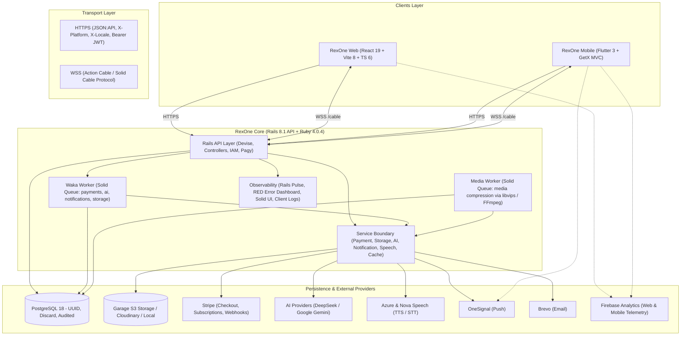

# 🏛️ The RexOne Ecosystem

A unified architectural specification and cross-platform contract spanning **RexOne Core** (Rails), **RexOne Web** (React), and **RexOne Mobile** (Flutter).

---

## 📜 Architectural Baseline

RexOne establishes a disciplined, production-grade foundation for modern digital products:

- **Identity & IAM**: Passwordless/passcode auth, Google SSO, granular role-based access control.
- **Commerce & Subscriptions**: Stripe Checkout, recurring billing, coupon redemptions, access entitlement ledger.
- **Background Queues**: Solid Queue hybrid Fiber + Thread workers, zero Redis dependency for jobs.
- **Asset Management**: Self-hosted S3-compatible Garage storage, async compression pipelines (libvips / FFmpeg).
- **Real-Time WebSockets**: Action Cable channels for notifications, AI streaming, live speech recognition.
- **Observability**: Server metrics (Rails Pulse), exception dashboard (RED), client error ingest (`Client::Log`).
- **Client Experience**: 100% localization parity (`en`, `es`, `my`), dynamic theming, offline SQLite storage (Drift).

### 🏛️ Essential Governance & Operations

| Resource                     | Scope & Canonical Specification                                                                                                                           |
| :--------------------------- | :-------------------------------------------------------------------------------------------------------------------------------------------------------- |
| 📜 **Constitutional Law**    | Strict engineering constraints and architectural rules: **[LAW.md](LAW.md)** _(Zero exceptions)_                                                          |
| 🌐 **Live Web Demo**         | Production web application preview: **[rexone.rex9.me](https://rexone.rex9.me)** (API: `api.rexone.rex9.me`)                                              |
| 🗺️ **Visual Walkthrough**    | Screenshot tour across Core, Web, Mobile, and operations: **[VISUAL_WALKTHROUGH.md](./docs/VISUAL_WALKTHROUGH.md)**                                       |
| 🛡️ **Production Operations** | Production hardening, Cloudflare edge defense, and DDoS protection: **[Production Deployment](docs/DEPLOYMENT.md)** & **[DDoS Protection](docs/DDOS.md)** |
| 🌐 **AI Discovery & GEO**    | Machine-readable context files (`/llms.txt`, `/llms-full.txt`), crawler policies: **[AI Discovery & GEO Guide](../rexone-web/docs/SEO_GEO.md)**           |
| 🎞️ **Media Playback**        | Short-lived signed provider URLs and streaming roadmaps: **[Media Playback](docs/MEDIA_PLAYBACK.md)** & **[Roadmap](docs/roadmaps/MEDIA_STREAMING.md)**   |

### 🌐 Multi-Environment Domain Strategy

Standardized across the ecosystem for any derivative product (custom TLD):

- **Demo Tier**: `rexone.rex9.me` (Web) & `api.rexone.rex9.me` (API)
- **Product Prod**: `<product>.<tld>` (e.g. `rexone.me`) & `api.<product>.<tld>` (e.g. `api.rexone.me`)
- **Product UAT**: `uat.<product>.<tld>` (e.g. `uat.rexone.me`) & `uat.api.<product>.<tld>` (e.g. `uat.api.rexone.me`)
- **Product Dev**: `dev.<product>.<tld>` (e.g. `dev.rexone.me`) & `dev.api.<product>.<tld>` (e.g. `dev.api.rexone.me`)

---

## 🌐 High-Level Ecosystem Topology



---

# 1. `rexone-core` (The Backend Engine)

### 🛠️ Tech Stack & Infrastructure

- **Runtime**: Ruby `4.0.4`, Rails `8.1.0` (API mode), PostgreSQL `18`.
- **Docker Compose**: Orchestrates a 5-container topology:
  - `api`: Rails API server on `:3000`.
  - `waka`: Dedicated Solid Queue worker for async business queues (`payments`, `ai`, `notifications`, `default`).
  - `media`: Quarantined Solid Queue worker for CPU-heavy compression (`libvips`, `FFmpeg`).
  - `db`: PostgreSQL `18` on `:5432`.
  - `garage`: Self-hosted S3-compatible distributed object storage on `:3100` API / `:3101` Admin.
- **Key Gems**: `devise`, `devise-jwt`, `solid_queue`, `solid_cable`, `solid_cache`, `discard` (soft deletes), `jsonapi-serializer`, `pagy` (pagination), `rails_pulse` (performance monitoring), `rails_error_dashboard` (exception tracking), `rswag` (OpenAPI/Swagger), `administrate` (internal admin dashboard).

### 📦 Database & Model Architecture

All tables use **UUID** primary keys (`gen_random_uuid()`), soft deletes via **Discard** (`discarded_at`, `undiscarded_at`), and user audit tracking via the **Auditable** concern (`created_by_id`, `updated_by_id`, `discarded_by_id`, `undiscarded_by_id`).

| Domain               | Key Models                                                                                                                             | Responsibilities                                                                                                                                                                                                               |
| :------------------- | :------------------------------------------------------------------------------------------------------------------------------------- | :----------------------------------------------------------------------------------------------------------------------------------------------------------------------------------------------------------------------------- |
| **Identity & Users** | `User`                                                                                                                                 | Devise authentication, JWT JTI revocation, 6-digit confirmation codes, 6-digit password reset codes, Google OAuth linking, Stripe customer generation, profile avatar assets.                                                  |
| **IAM (RBAC)**       | `Iam::Role`, `Iam::Permission`, `Iam::UserRole`, `Iam::RolePermission`                                                                 | Granular action-resource permissions (`user.can?(action, resource)`). System roles (`super_admin`, `admin`, default `user`). Dynamic auto-assignment on signup.                                                                |
| **Commerce**         | `Payment::Product`, `Payment::Subscription`, `Payment::Transaction`, `Payment::Coupon`, `Payment::UserCoupon`, `Payment::WebhookEvent` | Stripe product/price catalog, subscription items snapshot, percentage/fixed coupons with referral generation, targeting restrictions, immutable redemption ledger, transaction receipts, durable webhooks.                     |
| **Entitlements**     | `Access`                                                                                                                               | Granted, revoked, and expired product access records tied to users and products.                                                                                                                                               |
| **AI / Chat**        | `Chat::Room`, `Chat::Message`, `Ai::Profile`, `Ai::Run`                                                                                | Flexible chat rooms (`ai`, `direct`, `group`, hybrid), message processing jobs, 2,000-char message chunking (`split_id`, `chunk_index`, `total_chunks`), provider abstraction, execution telemetry.                            |
| **Media**            | `Asset`                                                                                                                                | Unified media records, Garage S3 storage keys (`user/{user_id}/...`, `admin/...`), compression telemetry, status (`pending`, `processing`, `ready`, `optimal`), child assets (`parent_asset_id` for thumbnails and subtitles). |
| **Telemetry**        | `Client::Log`                                                                                                                          | Client error ingest (stack traces, device, OS, browser, URL, severity, cookies, storage keys), linked to optional `version_id`.                                                                                                |
| **Feedback**         | `Feedback`                                                                                                                             | User rating (1–10), auto-inferred category (`bug`, `feature_request`, `improvement`, `general`), urgency (`low`, `normal`, `high`, `urgent`), device/route telemetry.                                                          |
| **Notifications**    | `Notification`, `UserNotification`                                                                                                     | Multi-channel templates (In-App, Push, Email) with dynamic variable interpolation (`user_name`, `user_email`, `link`, domain entities), persistent inbox receipts with Pagy pagination.                                        |
| **App Versions**     | `Client::Version`, `Client::UserVersion`                                                                                               | Marketing versions (`draft`, `published`, `yanked`), semantic version comparison, mandatory/optional update evaluation, client installation snapshots.                                                                         |

### ⚙️ Services & Background Concurrency (Solid Queue)

Solid Queue operates under a hybrid concurrency architecture configured in `config/queue.yml` and `config/queue.media.yml`:

- **Fiber Concurrency Worker (`waka`)**:
  - Non-blocking Ruby Fibers (`async`) running on Solid Queue with `config.active_support.isolation_level = :fiber`.
  - Runs up to 50 concurrent fibers on a single event loop across prioritized queues:
    - `payments`: Highest priority. Handles Stripe webhook fulfillment (`Payment::ProcessWebhookJob`) with strict idempotency.
    - `ai`: Handles chat workflows (`Chat::ProcessMessageJob`), provider streaming (DeepSeek, Gemini via OpenAI-compatible endpoints), and text-to-speech jobs (`Speech::ProcessTtsJob`).
    - `notifications`: Fans out Action Cable broadcasts, OneSignal push notifications, and Brevo transactional emails via `Notification::DispatchJob` and `Notification::DeliverJob`.
    - `default`: General asynchronous operations.
- **Thread Maintenance Worker**:
  - Runs 2 dedicated OS threads for sequential, transactional tasks: `solid_queue_recurring` and `default`.
  - Recurring tasks (`config/recurring.yml`) clean up stale caches, expired access records, processed webhook events, discarded records, and old notifications (`Notification::CleanupJob`: read >30d, unread >90d, discarded >7d).
  - Weekly data reconciliation via `DataSyncJob` calling `DataSyncService.sync_all!`. Lifetime counters (`sent_count`, `read_count`) are maintained atomically.
- **Quarantined Media Worker (`media`)**:
  - Runs in a dedicated container with OS threads to prevent CPU-intensive `libvips` and `FFmpeg` workloads from starving I/O-bound fiber queues.
  - Handles image/audio/video compression (`Media::CompressMediaJob`), SVG-to-PNG conversion (`Media::ConvertImageJob`), and video thumbnail generation.
  - Employs an **optimal-first pipeline**: if size reduction is `< 3%` or size does not decrease, the asset is marked `optimal`; otherwise, a configurable pass cap is enforced.
- **Storage Worker (`storage`)**:
  - `Storage::DeleteJob` asynchronously purges remote objects from Garage S3 after DB transactions commit.

### 🛡️ Active Platform Session Enforcement

- `ApplicationController` inspects the incoming `X-Platform` header (`web`, `android`, or `ios`).
- Checks against Redis/SolidCache key: `active_session:user:#{user_id}:#{platform}`.
- Allows up to **3 concurrent sessions** per user across different platforms (1 Web, 1 Android, 1 iOS).
- Automatically invalidates an older session when a new sign-in occurs on the _same_ platform type.

### 🔑 Authentication Architecture

- **Single-Field Entry (`/peek`)**: Clients send email or username to `GET /v1/auth/peek` (protected by a 12 req/min IP rate limiter). Core returns the account state so the client knows whether to prompt for login, initiate registration, or apply security cooldowns.
- **Passcode Authentication**: 6-digit numeric passcodes verified via Devise with escalating cooldown protection.
- **Google OAuth**: Links Google accounts directly, handles registration challenge flows, and sets up authentication without loose intermediate states.

### 🔐 RBAC Model & Administrative Hierarchy

Permissions follow a clean, four-level administrative model:

1. **`super_admin`**: Full system-wide authority over all resources, configurations, and IAM tables.
2. **`admin`**: Operational control across domain resources (`feedbacks`, `payments`, `ai`, `assets`, `logs`, `notifications`). Restricted from managing `users`, `iam`, `versions`, and `user_versions`.
3. **Partial Admin (`*_admin`)**: Scoped administrative roles (e.g. `feedback_admin`, `payment_admin`, `ai_admin`).
   - Must use the `*_admin` suffix convention.
   - Grants access only to specific `/v1/admin/*` resources matching the role's assigned permissions.
   - Non-admin permissions (e.g. from the base `user` role) can never access `/v1/admin/*` endpoints.
4. **Single-Request IAM Introspection**: `GET /v1/users/current/iam` returns complete role/permission sets (`is_admin`, `is_super_admin`, `roles`, `admin_roles`, `permissions`, `admin_permissions`) so clients evaluate UI permissions immediately without secondary calls.
5. **Unified Product Entitlements Flow (`UserSerializer.accesses`)**: Just like IAM permissions, active product accesses (`id`, `product_id`, `product_code`, `product_name`, `granted_at`, `expires_at`, `remaining_days`, `active`) are serialized directly into `UserSerializer.accesses` upon authentication (`/signin`, `/signup`, `/confirmation`) and session introspection (`GET /v1/users/me`). Frontends (Web & Mobile) persist this payload locally on boot, evaluate entitlements in-memory with real-time expiration awareness (`useAccess` in Web, `AuthController.hasAccess` in Mobile), and seamlessly refresh via WebSockets (`payment_success`, `subscription_created`, `access_granted`).

### 🛠️ Core Client-Admin API Endpoints

- **User Management**: `GET/POST /v1/admin/users`, `PATCH /v1/admin/users/:id`, `DELETE /v1/admin/users/:id` (CRUD, soft-delete discard/undiscard, role assignment, confirmation status auditing).
- **IAM Management**: `GET/PATCH/DELETE /v1/admin/iam/roles`, `GET/POST/PATCH/DELETE /v1/admin/iam/permissions`.
- **Chat Endpoints**: User API: `GET/POST /v1/chat/rooms`, `GET/PUT/DELETE /v1/chat/rooms/:id`, `GET/POST /v1/chat/messages`, `DELETE /v1/chat/messages/destroy_all`. Admin moderation: `GET/PATCH/DELETE /v1/admin/chat/rooms` and `GET/PATCH/DELETE /v1/admin/chat/messages`.
- **AI Control Plane & Universal TOON Pipeline**: `GET/PATCH /v1/admin/ai/profiles` (prompt templates, models, token limits, multi-attribute sorting and filters), `GET /v1/admin/ai/runs` (execution telemetry, latency, token consumption). RexOne enforces a universal **Zero-JSON LLM Pipeline**: Large Language Models never receive or output raw JSON. All inbound JSON (in user messages, assistant history, system prompts, or template values) is automatically converted to compact Token-Oriented Object Notation (TOON via `Ai::ToonService`), compressing context by 30–60% over JSON. Models are instructed to output structured data strictly in TOON format (` ```toon `). On receiving completions, the server transparently converts TOON structures back into standard, formatted JSON before database persistence and client WebSocket broadcasting, maintaining 100% standard JSON compatibility across web, mobile, and REST clients without requiring frontend TOON parsers.
- **Standardized Permissions Protocol**: Strictly 4 canonical CRUD actions (`read`, `create`, `update`, `delete`). Soft deletes map to `:delete`, restores map to `:delete`. Resources are explicitly prefixed (e.g. `ai_profiles`, `chat_rooms`, `payment_products`).
- **Product Management**: `GET/POST/PATCH/DELETE /v1/admin/payment/products`, Stripe catalog sync, active user access inspection (`GET /v1/admin/accesses?product_id=:id`).
- **App Versions**: Super-admin only. `GET/POST /v1/admin/client/versions`, discard/undiscard, and `GET /v1/admin/client/versions/:id/user_versions`.
- **User Versions**: Super-admin only. `GET /v1/admin/client/versions/user_versions` lists device snapshots with optional platform filtering.
- **Asset Management**: `GET /v1/assets` (list assets by type), `POST /v1/assets/upload` (direct upload), `GET /v1/assets/:id/playback` (S3 SigV4 signed playback URL), `GET /v1/assets/:id/subtitles/:subtitle_id` (CORS-enabled raw VTT/SRT text). Admin API: `GET/PUT/DELETE /v1/admin/assets`, `GET /v1/admin/assets/storage_stats` (bucket, object, and host disk capacity), manual secondary compression triggers.
- **Video Thumbnails & Subtitles**: Core generates WebP thumbnails asynchronously and broadcasts `asset_thumbnail_generated`. Admins can upload thumbnail replacements or attach `.srt` subtitle files (`POST /v1/admin/assets/:id/subtitle/upload`). Subtitles are served inline with pre-fetched text.
- **Notifications**: `GET/POST /v1/admin/notifications`, `POST /v1/admin/notifications/dispatch` (audience fanout by roles/users/all), and `GET/DELETE /v1/admin/user_notifications` (receipt lifecycle, recycle bin management).

---

# 2. `rexone-web` (The React Client)

### 🛠️ Tech Stack

- **Core**: React `19`, TypeScript `6`, Vite `8`, Tailwind CSS `4`, DaisyUI, Headless UI, Heroicons, Lucide.
- **State Management**: React Contexts (`AuthContext`, `LoadingContext`, `ToastContext`), Jotai atomic stores.
- **Networking**: Axios instance with centralized auth interceptors; Action Cable JS client for WebSockets.
- **Localization**: `i18next` with strictly typed keys (`en`, `es`, `my`).

### 🎨 Design System Architecture (`src/design/`)

- **Atoms & Tokens**: Neon Scarlet Red (`#FF2238`), Secondary Vermilion (`#FF4D2E`), Accent Laser Red (`#FF0D2D`), Deep Night Canvas (`#160B11`), 8-based spacing grid, soft radius scale (`xs` to `full`).
- **Inputs**: `TextInput`, `TextArea`, `PasswordInput`, `Dropdown`, `Toggle`, `DateTimePicker` (with automatic UTC $\leftrightarrow$ Local conversion), `NumberInput`.
- **Overlays**: `Dialog`, `ConfirmDialog` (for destructive actions), `LoadingOverlay` (high-opacity backdrop blur), `Toast`. Universal loading managed via `LoadingContext`.
- **Buttons**: Polymorphic `Button` (renders semantic `<a>` or `<button>` with identical styling and running neon laser borders), `GoogleButton`, `SignOutButton`. Zero raw `<a>` or `<button>` tags in domain pages.
- **Media**: `Asset`, `Image`, `Video`. Zero raw `` or `<video>` tags.

### 🧩 Domain Modules & Flows

- **Authentication**: URL-driven dialog flow (`?dialog=auth&step=...`). Passwords held strictly in memory; zero leakage into URL params or storage.
- **Commerce & Billing**: Product catalog, coupon validation (`/v1/payment/coupons/validate`), Stripe Checkout handoff, instant provisioning for 100% free coupons, active subscription management, and detailed discount breakdown cards.
- **AI Workspace**: Queued conversational interface. Displays thinking states, streams responses over WebSocket (`useAiSocket`), and auto-refreshes conversation history.
- **Speech & Audio**: Streams binary MP3 audio directly from `/v1/speech/tts` without base64 overhead, plays message TTS, and connects live WebSocket audio recognition.
- **Asset Control Center (`/admin/assets`)**: Live VPS and Garage storage dashboard, multi-file batch uploads with optimistic progress, searchable parent asset picker (`AdminParentAssetSelect`), real-time compression badges, and secondary compression triggers.
- **Admin AI Control Panel (`/admin/ai`)**: Profiles management (`AdminAiProfileCreatePage`, `AdminAiProfileEditPage`) with provider/model selectors, temperature/token boundaries, and prompt editors; AI execution audit log (`AdminAiRunsPage`) with latency and token breakdowns.
- **AI Discovery & SEO/GEO**: Standardized `/llms.txt`, `/llms-full.txt` (llmstxt.org standard), comprehensive crawler rules in `robots.txt`, and Schema.org `SoftwareApplication` rich results in `index.html`.
- **Admin Portal Governance**: Route guards (`AdminRootRoute`), client-side permission checks (`usePermissions`), confirmation status badges (`confirmed` / `unconfirmed`), and operational KPI navigation.

---

# 3. `rexone_mobile` (The Flutter Mobile Client)

### 🛠️ Tech Stack & Architecture

- **Framework**: Flutter `3.x`, Dart `3.x`.
- **Architecture**: GetX MVC (Pages $\rightarrow$ Controllers $\rightarrow$ Services $\rightarrow$ Models), dependency injection via `InitialBinding`.
- **Core Packages**: `GetStorage` (persistence), `Drift` (local SQLite database), `Flutter ScreenUtil` (375x812 baseline), `Flutter Dotenv` (`.env.dev`, `.env.uat`, `.env.prod`), `Google Sign In`, `OneSignal Flutter`, `Firebase Analytics`, `media_kit`, `upgrader`.

### 🎨 Mobile Design System (`lib/design/`)

- **Design System Tokens**: `AppColors`, `AppTypography`, `AppSpacing`, `AppStyles`, `AppIcons`, `AppMedia`, `AppTheme` (Material 3 Light/Dark).
- **Theme Extensions**: Reactive styling via `context.colors.*` and `context.typo.*`.
- **UI Components**: `AppButton`, `AppInputField`, `AppPasswordField`, `AppLoading`, `AppSnackbar`, `AppDialog` (with `AppDialog.confirm()` for destructive flows), `AppPage`, `AppListTile`, `AppToggle`, `AppNetworkBanner` ("Offline mode" banner).

### 🧩 Domain Capabilities

- **Auth Flow**: Parity with Web & Core (email peek, 6-digit passcode, OTP verification, Google OAuth, session invalidation).
- **Push Notifications**: OneSignal integration (`PushNotiService`). Syncs user ID and tags on login, clears on logout. Deletions confirmed via `AppDialog.confirm()`.
- **Email Delivery**: Multi-channel templates rendered through a responsive email layout (`TemplateRenderer`) with dynamic variables and normalized absolute client URLs (`AppConfig.client_url`).
- **Product Analytics**: Firebase GA4 integration using constantized `action_noun` events (`sign_up`, `sign_in`, `view_product`, `purchase_product`, `open_notification`) tagged with platform (`android`, `ios`).
- **Stripe & Billing**: In-app Stripe Checkout WebView (`CheckoutPage`), subscription management cards, cancellation confirmation, canonical currency minimum charge limits (`StripeMinimumAmounts`).
- **AI Assistant**: Persistent multi-room chat, JSON:API response parsing, background thinking indicators, real-time completion toasts over WebSocket.
- **Media Playback & Lyrics**: Mixed audio/video playlist from `GET /v1/assets`, signed streaming URLs from `GET /v1/assets/:id/playback`, background audio player, inline video (`media_kit`), and synced `.srt` subtitles/lyrics with per-track selection.
- **Offline Media & SQLite (Drift)**: AES-GCM encrypted sandbox downloads backed by local Drift SQLite database (`rexone_offline`). Local-first playback preferences and storage management dialog.
- **Client Telemetry**: Uncaught Flutter and platform dispatcher errors dispatched to Core via `POST /v1/client/logs`.
- **Localization**: 100% translated in English (`en_US`), Spanish (`es_ES`), and Burmese (`my_MM`). Synchronizes `X-Locale` and `Accept-Language` headers on every HTTP request.

---

# 4. 📊 Feature Parity Matrix

| Capability Area                                                       | `rexone-core` |     `rexone-web`     |     `rexone_mobile`      |
| :-------------------------------------------------------------------- | :-----------: | :------------------: | :----------------------: |
| **Auth: Email & 6-digit Passcode**                                    |      ✅       |          ✅          |            ✅            |
| **Auth: Google Sign-In & Challenge Flow**                             |      ✅       |          ✅          |            ✅            |
| **Auth: Active Single-Platform Session Enforcement**                  |      ✅       |          ✅          |            ✅            |
| **Auth: Escalating Password Retry Cooldown (Redis)**                  |      ✅       |          ✅          |            ✅            |
| **Light & Dark Theming**                                              |      N/A      |          ✅          |            ✅            |
| **Multi-Language Localization (`en`, `es`, `my`)**                    |      ✅       |          ✅          |            ✅            |
| **HTTP `X-Locale` / `Accept-Language` Synchronization**               |      ✅       |          ✅          |            ✅            |
| **Destructive Action Confirmation Prompts**                           |      N/A      | ✅ (`ConfirmDialog`) | ✅ (`AppDialog.confirm`) |
| **Error Telemetry Ingest & Storage (`/v1/client/logs`)**              |      ✅       |          ✅          |            ✅            |
| **Stripe: Product & Pricing Catalog**                                 |      ✅       |          ✅          |            ✅            |
| **Stripe: Checkout Session Handoff**                                  |      ✅       |    ✅ (Redirect)     |       ✅ (WebView)       |
| **Stripe: Subscriptions & Cancellation/Resumption**                   |      ✅       |          ✅          |            ✅            |
| **Stripe: Transaction History & Discount Audits**                     |      ✅       |          ✅          |            ✅            |
| **User Feedback System (1–10 Rating & Auto-Triage)**                  |      ✅       |          ✅          |            ✅            |
| **Chat: Conversational Rooms (AI, Direct, Group)**                    |      ✅       |          ✅          |            ✅            |
| **AI: Queued Background Execution (DeepSeek / Gemini)**               |      ✅       |          ✅          |            ✅            |
| **AI: Real-Time WebSocket Completion Alerts**                         |      ✅       |          ✅          |            ✅            |
| **Speech: Text-to-Speech (Binary Audio Streaming)**                   |      ✅       |          ✅          |            ✅            |
| **Speech: Speech-to-Text (Upload & URL)**                             |      ✅       |          ✅          |            ✅            |
| **Speech: Live Audio STT Streaming (WebSocket)**                      |      ✅       |          ✅          |            ✅            |
| **Media: Multi-Provider Storage (Garage S3, Cloudinary, Local)**      |      ✅       |          ✅          |            ✅            |
| **Media: Background Compression (libvips / FFmpeg)**                  |      ✅       |          ✅          |           N/A            |
| **Media: Real-Time WebSocket Compression Updates**                    |      ✅       |          ✅          |           N/A            |
| **Media: Batch Upload & Optimal-First Pipeline**                      |      ✅       |          ✅          |           N/A            |
| **Media: Audio/Video Playlist & Synced SRT Subtitles**                |      ✅       |         N/A          |            ✅            |
| **Media: Signed Playback URL Resolution (`/v1/assets/:id/playback`)** |      ✅       |         N/A          |            ✅            |
| **Offline Media Downloads & Drift SQLite Database**                   |      N/A      |         N/A          |            ✅            |
| **Push Notifications (OneSignal)**                                    |      ✅       |         N/A          |            ✅            |
| **Product Analytics (Firebase)**                                      |   Constants   |          ✅          |            ✅            |
| **Client Admin Panel (RBAC, Users, IAM, Products, Assets)**           |      ✅       |          ✅          |           N/A            |
| **Admin AI Control Panel (Profiles & Runs Telemetry)**                |      ✅       |          ✅          |           N/A            |
| **In-App Version Upgrader & Splash Check**                            |      ✅       |          ✅          |            ✅            |
| **AI Discovery & Generative Engine Optimization (GEO)**               |      N/A      |          ✅          |           N/A            |

---

# 5. 🔌 Interoperability & Communication Protocols

### 1. HTTP / REST API Conventions

- **Base URL**: `/v1/`
- **Standard Request Headers**:

  ```http
  Authorization: Bearer <JWT_TOKEN>
  X-Platform: web | android | ios
  X-Locale: en | my | es
  Accept-Language: en | my
  Content-Type: application/json
  ```

- **Standard JSON:API Response Envelope**:
  ```json
  {
    "status": {
      "code": 200,
      "success": true,
      "message": "Localized status description",
      "error": null
    },
    "data": { ... },
    "meta": {
      "token": "...",
      "storage_details": { ... },
      "pagination": {
        "current_page": 1,
        "total_pages": 5,
        "total_count": 50,
        "limit": 10,
        "next_page": 2,
        "prev_page": null
      }
    }
  }
  ```

- **Strict Separation of Primary Entity (`data`) and Auxiliary Metadata (`meta`) (Law C2, Law U14)**:
  - `data` strictly encapsulates the primary domain entity (`Serializer.record(record)`) or resource collection (`Serializer.collection(collection)`).
  - Redundant nested wrapper keys (`{ user: ... }`, `{ asset: ... }`, `{ role: ... }`, `{ product: ... }`, `{ room: ... }`) inside `data` are strictly forbidden and completely eradicated.
  - `meta` strictly encapsulates all auxiliary metadata and operation context outside of `data`. This includes authentication tokens (`token`), verification states (`otp_sent`, `password_required`, `challenge_token`), rate-limiting feedback (`remaining_attempts`, `cooldown_remaining`), cloud storage upload metrics (`storage_details`), and collection pagination (`pagination`).
  - **Zero Legacy Fallbacks**: Frontends (Web and Mobile) do not maintain backward-compatibility shims or fallback chains (`meta?.token ?? data?.token`, `data?.user ?? data`). Contracts are deterministic, clean, and unambiguous.

- **Canonical 5 Serializer Standards (`ApplicationSerializer`)**:
  All serializers inherit from `ApplicationSerializer` (`jsonapi-serializer`). Controllers and services must **never** call raw `.serializable_hash` directly; serialization is strictly centralized through 5 canonical class methods:
  1. `record(record, options = {})`: Serializes a single JSON:API resource (`{ id, type, attributes }`). Used for single record GET/POST/PATCH responses (`data: Serializer.record(record)`). Redundant top-level entity wrapper hashes (e.g. `{ user: ... }`, `{ asset: ... }`, `{ user_version: ... }`) are strictly forbidden for single-record responses.
  2. `collection(collection, options = {})`: Serializes a JSON:API resource array (`[{ id, type, attributes }]`).
  3. `paginated(collection, pagy, options = {})`: Serializes a paginated JSON:API collection with standard `meta.pagination` envelope (`{ data: [...], meta: { pagination: { current_page, total_pages, total_count, limit, next_page, prev_page } } }`).
  4. `record_attributes(record, options = {})`: Extracts a clean, flat attribute hash (`{ id, ... }`). Used for nested object attributes inside serializers or composite multi-key operation hashes.
  5. `collection_attributes(collection, options = {})`: Extracts a clean, flat array of attribute hashes (`[{ id, ... }]`). Used for nested collections inside serializers (e.g. `user.accesses`, `asset.subtitles`, `subscription.items`).

- **Universal Collection Pagination & Zero "All" Flags (Law U8)**:
  - **All Top-Level Collections Are Paginated**: Every list/collection endpoint MUST paginate via `Pagy` (`pagy, records = pagy(scope)`) and return the standardized envelope with `data` array and `meta.pagination`.
  - **Default Full Collection (Omitted Params)**: If a client omits `page` and `limit`, `PagyHelper#pagy` calculates total count and automatically returns all records on `page: 1` (`limit: [total_count, 1].max`) wrapped inside a compliant pagination envelope. Clients never pass arbitrary string flags (`limit: "all"`).
  - **Zero Pagination for Nested Collections**: Embedded associations inside serializers (e.g. `UserSerializer.accesses`, `AssetSerializer.subtitles`) MUST NEVER be paginated; they always return all associated items cleanly as flat attribute lists via `collection_attributes`. If a client requires paginated sub-resources, it queries the dedicated top-level collection endpoint with pagination filters (e.g., `GET /v1/admin/accesses?user_id=:id&page=1&limit=20`).

- **Client-Side Centralized Parsing Standard (Law W8)**:
  - **RexOne Web (React)**: All API consumer controllers MUST use centralized parsers from `@/services/api.service`: `parseRecord<T>(record)` for single entities and `parsePagyList<T>(response)` for paginated collections (returning `{ records, pagination }`). The parsers cleanly unwrap `{ id, type, attributes }` JSON:API envelopes into flat domain entities while handling flat payloads. Controllers must never perform manual `.attributes` drilling.
  - **RexOne Mobile (Flutter)**: Standardized strictly on only two centralized parsers in `ApiService`: `ApiService#parseRecord<T>(response, [fromJson])` for single entities/envelopes and `ApiService#parsePagyList<T>(response, fromJson)` for paginated collections (returning `PaginatedResponse<T>` with `records` and `pagination`). Zero legacy helpers (`ApiHelper`, `parseResponse`, `parseEnvelopeResponse`, `parseList`).
  - **Chat Message Creation Contract (`POST /v1/chat/messages`)**: Responses provide primary user message in `data` (`Chat::MessageSerializer.record`), full messages array in `messages` (`Chat::MessageSerializer.collection`), and metadata in `meta` (`room_id`, `messages`). Both Web and Mobile clients gracefully parse either `data` (single message), `messages` (list), or `meta.messages`.
  - **Asset Creation & Upload Contract (`POST /v1/admin/assets`, `POST /v1/assets/upload`)**: Single asset responses deliver the record serialized via `AssetSerializer.record` directly in `data`, accompanied by storage metadata in `meta.storage_details`. Frontends parse `data` directly into the asset entity and retrieve storage details from `meta`.


### 2. App Version Resolution Protocol

- **Endpoint**: `GET /v1/client/versions/current?version=1.2.0&build_number=42`
  - Headers: `X-Platform: ios | android | web` (No JWT required).
  - Evaluates semantic marketing version first; if equal, evaluates platform build numbers (`ios_build_number` or `android_build_number`).
  - Response Format: Returns `data` serialized via `Client::VersionSerializer.record` containing standard JSON:API `{ id, type: "client_version", attributes: { number, update_required, must_update, skip_premium, store_url, ... } }`.
- **Response Flags**:
  - `update_required`: `true` when client version is strictly behind the live published version (triggers non-blocking update prompt).
  - `must_update`: `true` when the live version is flagged as force update and is newer than the client (triggers mandatory blocking modal).
  - `skip_premium`: `true` when client version is strictly newer than the live published version (e.g. app store review builds).
  - `store_url`: Platform store URL configured via `IOS_STORE_URL` or `ANDROID_STORE_URL`.
- **Client Handling**:
  - Mobile: When `must_update` is true, `SplashPage` presents an un-bypassable `PopScope(canPop: false)` blocking screen. Optional updates (`update_required: true && !must_update`) prompt on `HomePage` via `AppDialog.update(...)`. `VersionModel.fromJson` and `ApiService#parseRecord` seamlessly resolve both JSON:API attributes envelopes and flat key structures.
  - Device Snapshot: Authenticated clients submit `POST /v1/client/versions/user-version` with `{ user_version: { version, build_number } }` to upsert installation telemetry.

### 3. Real-Time WebSockets (Action Cable)

- **Endpoint**: `/cable`
- **Authentication**: JWT token passed via connection query param (`?token=<JWT>`) or subscription payload.
- **Channels**:

#### `NotificationChannel` (`notification_user_{user_id}`)

Broadcasts async processing events, payment confirmations, and in-app inbox items:

| Event Type                                      | Payload Attributes                                                                               | Description                                        |
| :---------------------------------------------- | :----------------------------------------------------------------------------------------------- | :------------------------------------------------- |
| `ai_response_ready`                             | `room_id`, `message_id`                                                                          | AI message generation finished.                    |
| `ai_response_failed`                            | `room_id`, `error`                                                                               | AI generation failed.                              |
| `tts_ready`                                     | `message_id`, `asset_id`                                                                         | TTS audio synthesis completed.                     |
| `tts_failed`                                    | `message_id`, `error`                                                                            | TTS audio synthesis failed.                        |
| `asset_updated`                                 | `id`, `status`, `size_bytes`, `compressed_size_bytes`, `compression_ratio`, `compression_passes` | Real-time compression status updates.              |
| `asset_thumbnail_generated`                     | `asset_id`, `thumbnail`                                                                          | Video thumbnail generated in background.           |
| `payment_success`                               | `product_name`, `amount`                                                                         | Successful Stripe payment confirmation.            |
| `subscription_created` / `canceled` / `resumed` | `product_name`, `active_until`                                                                   | Subscription status transitions.                   |
| `in_app_notification`                           | `id`, `title`, `message`, `link`, `read_at`, `created_at`, `metadata`                            | New persistent notification received.              |
| `welcome`                                       | `{}`                                                                                             | Emitted upon successful Action Cable subscription. |

_Navigation targets_: `link` represents the destination. Common internal destinations: `/home`, `/profile`, `/payment`, `/ai`. External URLs (`https://`) open in a new tab on Web and request user confirmation before opening the system browser on Mobile.

#### `SpeechLiveChannel` (`speech_live_{user_id}`)

Provides bidirectional streaming for real-time speech recognition:

- **Subscription Params**: `{ "channel": "SpeechLiveChannel", "language": "en-US" }`
- **Client RPC Actions**:
  - `audio`: Streams 16-bit 16kHz mono base64 PCM audio chunk: `{ "action": "audio", "chunk": "<base64_pcm>" }`
  - `stop`: Concludes stream and requests final transcription: `{ "action": "stop" }`
- **Server Events**:
  - `partial`: Interim transcription: `{ "type": "partial", "text": "...", "is_final": false }`
  - `final`: Final transcription chunk: `{ "type": "final", "text": "...", "is_final": true }`
  - `error`: Error payload: `{ "type": "error", "error": "Reason" }`

### 4. Client Telemetry Contract (`POST /v1/client/logs`)

Used by Web and Mobile clients to report unhandled JavaScript or Dart exceptions:

```json
{
  "log": {
    "message": "Exception description",
    "severity": "error",
    "platform": "web" | "android" | "ios",
    "environment": "development" | "staging" | "production",
    "app_version": "1.0.0",
    "os": "Android",
    "os_version": "14",
    "device": "Pixel 8",
    "browser": "Chrome",
    "browser_version": "124.0.0",
    "url": "/payment",
    "method": "APP_EVENT",
    "stack_trace": ["..."],
    "local_storage_keys": ["auth_token", "user_email"],
    "session_storage_keys": [],
    "cookies": []
  }
}
```

_Version resolution_: Core maps `app_version` to a matching `Client::Version` record and stores `version_id`. If the version string is unrecognized, `version_id` remains `null` without rejecting the error report (no 422).

### 5. Security & Cooldown Schedules

- **Password Authentication Retry Escalation**:
  - Tracked via Redis/SolidCache keys: `password:attempts:{user_id}` and `password:cooldown:{user_id}`.
  - 3 failures $\rightarrow$ 30s cooldown
  - 6 failures $\rightarrow$ 60s cooldown
  - 9 failures $\rightarrow$ 120s cooldown
  - 12+ failures $\rightarrow$ 300s (5-minute) cooldown
  - Clients consume `meta.remaining_attempts` and `meta.cooldown_remaining` to drive UI timers.
- **Password Reset Email Cooldown (`POST /password/forgot`)**:
  - Key: `password_reset:cooldown:{user_id}`.
  - Enforces a **60s cooldown** between consecutive reset requests.
  - Returns `429 Too Many Requests` with `meta.cooldown_remaining`.

### 6. Dashboard Separation

- **Backend Infrastructure Dashboards**:
  - **Rails Pulse**: CPU load, memory usage, request latency, slow database queries.
  - **RED (Rails Error Dashboard)**: Server-side Ruby exceptions and backtraces.
  - **Solid UI**: Background job queue throughput, retry backoffs, recurring cron jobs.
  - **Rails Administrate**: Low-level database table inspection. Super-admin access only for sensitive tables.
- **Client Admin Panel (React SPA)**:
  - Focused strictly on **business operations and end-user governance**:
    - Revenue analytics, subscription metrics, user growth KPIs.
    - RBAC management (users, roles, permissions).
    - Commerce catalog, coupons, and redemptions audit.
    - Feedback triage (ratings, categories, urgency levels).
    - Client telemetry (`Client::Log` browser and mobile crashes).

### 7. Commerce & Coupon System Protocol

- **Validation Contract (`POST /v1/payment/coupons/validate`)**:
  - Request: `{ "code": "SAVE20", "product_id": "UUID" }` (Bearer auth required).
  - Success (200 OK):
    ```json
    {
      "code": 200,
      "message": "Coupon is valid.",
      "data": {
        "valid": true,
        "coupon": {
          "id": "UUID",
          "code": "SAVE20",
          "title": "20% Off",
          "coupon_type": "percentage",
          "amount": 20,
          "currency": "usd"
        },
        "original_amount": 1000,
        "discount_amount": 200,
        "final_amount": 800,
        "currency": "usd"
      }
    }
    ```
  - Invalid Code (422 Unprocessable Content):
    ```json
    {
      "code": 422,
      "message": "Coupon is invalid.",
      "error": "Coupon is invalid.",
      "meta": {
        "remaining_attempts": 2,
        "cooldown_remaining": 0
      }
    }
    ```
  - Cooldown Active (429 Too Many Requests):
    ```json
    {
      "code": 429,
      "message": "Coupon is invalid.",
      "error": "Too many invalid coupon attempts. Please wait 30 seconds before trying again.",
      "meta": {
        "remaining_attempts": 0,
        "cooldown_remaining": 30
      }
    }
    ```
- **Security & Anti-Brute-Force Protection**:
  - **Uniform Error Masking**: Non-existent, expired, maxed-out, or user-restricted coupons all return the identical message `"Coupon is invalid."` to prevent code probing.
  - **Progressive Cooldown Ladder**: 3 attempts $\rightarrow$ 30s, 6 attempts $\rightarrow$ 60s, 9 attempts $\rightarrow$ 120s, 12+ attempts $\rightarrow$ 300s cooldown.
  - **Reset**: Successful redemption or checkout immediately clears attempt and cooldown counters.
- **Checkout Integration (`POST /v1/payment/session`, `GET /v1/payment/session/:session_id`)**:
  - `POST /v1/payment/session`: If `final_amount > 0`: Creates Stripe Checkout Session with `discounts: [{ coupon: stripe_coupon_id }]`, appending `session_id={CHECKOUT_SESSION_ID}` to `success_url`, returning `{ "checkout_url": "...", "session_id": "..." }`.
  - If `final_amount == 0`: Bypasses Stripe, records `Payment::Transaction` (with `unit_amount: product.unit_amount, amount_received: 0`), creates `Payment::UserCoupon`, and grants access via `AccessService.grant(...)`.
  - `GET /v1/payment/session/:session_id`: Immediate client fulfillment upon reaching the success return URL. Inspects session status and immediately provisions subscription/transaction records and entitlement grants (`AccessService.grant(...)`) without waiting for background webhook delivery.
- **Referral Coupons**:
  - Every user signup automatically generates a unique referral code (`REF` + 6 random uppercase alphanumeric characters, e.g. `REF7K9M2P`) offering a 20% discount with `max_usage_per_user: 1`.
- **Canonical Stripe Minimum Limits**:
  Enforced across Core (`PaymentConstants::StripeMinimumAmount`), Web (`STRIPE_MINIMUM_AMOUNTS`), and Mobile (`StripeMinimumAmounts`):
  - **USD**: 50 cents ($0.50)
  - **SGD**: 50 cents (S$0.50)
  - **EUR**: 50 cents (€0.50)
  - **GBP**: 30 pence (£0.30)
  - **CAD**: 50 cents (CA$0.50)
  - **AUD**: 50 cents (AU$0.50)
  - **JPY**: 50 yen (¥50)
  - Default fallback: 50 units
- **Product Pricing Type Immutability & Bidirectional Stripe Sync**:
  - **Permanent Pricing Mode Lock**: Once created, a Product's pricing type (Free vs Premium) cannot be transitioned in either direction (`Payment::Product` enforces bidirectional immutability on update; Web Admin product form permanently disables the radio selector in edit mode).
  - **100% Discount Coupons**: Premium products support 100% discount coupons for zero-cost checkout without altering product classification or detaching payment provider handling.
  - **Discarded Scope Integrity**: Discarded products remain treated as "not found" via `default_scope -> { kept }`. No access is granted for discarded products, and they are omitted from client catalogs except in administrative recycle bins.
  - **Hardened Webhook Ingestion**: Webhooks update product name, description, and active status directly even when `default_price` is omitted. Sync guards prevent non-default prices from overwriting primary product definitions, ignore unsupported currencies, reject remote conversions between free and premium, and restore discarded records (`undiscard`) when reactivated in Stripe.
- **Discount Audit Breakdown**:
  - `Payment::Transaction` and `Payment::Subscription` associate `has_one :user_coupon` and `has_one :coupon`.
  - Detail views display dedicated discount cards: coupon code, title, discount amount deducted, original amount, and net charged amount.
- **Recurring Entitlement Durations**:
  - Recurring billing periods use canonical intervals (`PaymentConstants::BillingInterval`: `day`, `week`, `month`, `year`).
  - Access durations calculate via `product.interval_in_duration` (`1.day`, `7.days`, `30.days`, `365.days`) to ensure continuous coverage across all billing cycles.
- **Batch Coupon Generation & Stripe Synchronization**:
  - `POST /v1/admin/payment/coupons/batch` caps requests at 100 coupons per batch.
  - Coupons are created with `active: false` and `metadata.status = "processing"`.
  - Synchronized to Stripe asynchronously in slices of 50 via `Payment::SyncBatchCouponsJob` on queue `:payments`.
  - Successfully synced coupons become `active: true` (`metadata.status = "succeeded"`). Failed coupons remain `active: false` with logged errors for administrative inspection.
- **Targeting Restrictions**:
  - Coupons accept specific recipient emails via `target_user_emails: []`.
  - Core resolves emails to user UUIDs and stores them in PostgreSQL `target_user_ids: uuid[]`, rejecting unresolvable emails with a descriptive 422 error.
- **Recycle Bin & Lifecycle Operations**:
  - Soft delete (`discard`) moves coupons to the recycle bin while preserving Stripe sync IDs for potential restoration.
  - Hard delete (`destroy`) permanently purges the coupon and its dependent redemption records from the database and Stripe.
  - Discarded coupons remain inspectable via `/v1/admin/payment/coupons/:id` and `/v1/admin/payment/coupons/:id/redemptions`.

---

<div align="center">
  <sub>Built with discipline and care across the entire RexOne ecosystem.</sub>
</div>
