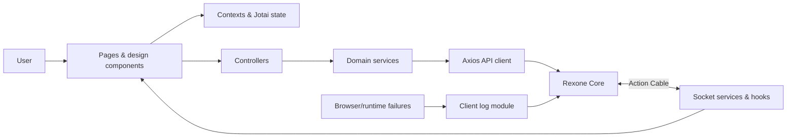

<a id="readme-top"></a>

<div align="center">

# Rexone Web

### A disciplined React client, built to turn a powerful foundation into a clear product experience.

A production-minded web foundation for authenticated products. Identity, payments, access control, media, AI, real-time delivery, localization, client telemetry, and reusable interface primitives meet here—not as isolated demos, but as one coherent browser application.

Built under the same creed as Rexone Core: **clear in thought, exact in structure, simple in use, and strong enough to endure what comes after launch.**

[](https://react.dev/)
[](https://www.typescriptlang.org/)
[](https://vite.dev/)
[](https://tailwindcss.com/)

**Typed · Modular · Localized · Observable · API-driven**

[Explore the client](#feature-map) · [Ecosystem Architecture](ECOSYSTEM.md) · [Run it locally](#getting-started) · [Meet the architecture](#architecture) · [Connect the API](#configuration)

</div>

---

> 🏛️ **Unified Ecosystem**: For the complete cross-platform architecture, 100% feature parity matrix, and communication protocols between Core, Web, and Mobile, see **[ECOSYSTEM.md](ECOSYSTEM.md)**.

## Why Rexone Web?

A capable backend is only half a product. The browser still has to manage identity, expired sessions, protected navigation, asynchronous failures, payment handoffs, live connections, loading states, localization, and the thousand small interactions that decide whether a system feels dependable.

Rexone Web exists so that work does not have to be improvised for every product built on Rexone Core.

This is not a gallery of components pretending to be an application architecture. Routes, contexts, controllers, services, models, modules, and design primitives have distinct responsibilities. Authentication flows preserve only appropriate state in the URL. API interceptors coordinate credentials and session expiry. Errors leave the browser as structured telemetry. Product capabilities remain grouped by domain instead of dissolving into a global collection of requests and screens.

The client is designed to **bend around the product**, never to make the product kneel before the foundation.

Its boundaries are deliberate. UI components own interaction and presentation. Controllers coordinate application outcomes. Services own transport. Models describe contracts. Contexts own cross-cutting browser state. Modules keep product capabilities together. The result is a foundation that can grow without making every feature depend on every other feature.

And no—the interface was not assembled by stacking dependencies until a demo appeared.

Authentication edge cases were traced. Sensitive passcodes were kept out of URLs. Session replacement and expiry were handled centrally. Runtime and React failures were made observable. Translation keys were organized by domain. The client is built to remain understandable after the first release, not merely attractive before it.

## The philosophy

Rexone Web follows the same doctrine as the core it serves:

> **Clarity before cleverness. Precision before haste. Simplicity without weakness. Strength without spectacle.**

The difficult part of frontend work is rarely rendering one more screen. It is preserving a system that remains coherent when routes multiply, API contracts evolve, providers fail, languages expand, and product-specific experiences begin to pull in different directions.

So the ambition is not to provide the largest component library or the most elaborate state layer.

It is to provide a **clear client foundation**—strong enough to carry ambitious products, flexible enough to surrender its shape to them, and disciplined enough that the next developer can follow data from interaction to API and back without archaeology.

## Feature map

| Foundation | What is ready | Details |
| --- | --- | --- |
| Identity | Email/passcode flows, confirmation, recovery, Google sign-in, session expiry | [Authentication & security](#authentication--security) |
| Navigation | Public and protected routes with centralized route definitions | [Routing & access](#routing--access) |
| Design | Reusable inputs, buttons, dialogs, overlays, media, themes, and typography | [Design system](#design-system) |
| State | React contexts, Jotai atoms, and deliberate browser persistence | [State & application flow](#state--application-flow) |
| Commerce | Product selection, Stripe Checkout handoff, success, and cancellation flows | [Payments & entitlements](#payments--entitlements) |
| Media | Authenticated upload requests and reusable image/video presentation | [Media & assets](#media--assets) |
| AI | Non-blocking queued chat, durable history, live completion alerts, and language tools | [AI capabilities](#ai-capabilities) |
| Real time | Action Cable-compatible WebSocket lifecycle and reconnect handling | [Real-time delivery](#real-time-delivery) |
| Localization | English, Spanish, and Burmese resources with organized typed keys | [Localization](#localization) |
| Observability | React boundary, global browser capture, structured context, and Core API delivery | [Client observability](#client-observability) |
| Quality | TypeScript builds, ESLint, Vitest, and production preview tooling | [Quality toolchain](#quality-toolchain) |
| Delivery | Vite production output and a Docker-based development environment | [Delivery](#delivery) |

## Architecture

Rexone Web keeps browser concerns explicit and domain behavior grouped.



The main boundaries are:

- `design/` owns pages, reusable components, and visual primitives.
- `modules/` groups domain behavior such as authentication, payments, AI, logging, and administration.
- `controllers/` coordinate responses that are shared outside a single domain module.
- `services/` own HTTP, sockets, persistence, and other transport concerns.
- `contexts/`, hooks, and Jotai atoms own shared client state and lifecycle behavior.
- `models/` describe API envelopes, resources, pagination, users, and application data.
- `locales/` owns i18n initialization, typed translation keys, and translation helpers.
- `routes/` owns browser routing and public/protected access boundaries.

The UI does not need to know how Axios is configured, and transport code does not decide how a dialog should behave. That separation keeps provider and backend details from spreading through presentation code.

## The client in detail

### Authentication & security

- Email-based account discovery followed by sign-in or registration.
- Six-digit passcode creation, confirmation, and sign-in flows.
- Email confirmation code entry and resend cooldowns.
- Forgot-passcode and reset-passcode flows.
- Google OAuth sign-in, including the Core challenge flow for new accounts.
- In-memory handling of passcodes; sensitive values are deliberately excluded from URL parameters.
- JWT-backed authenticated requests through the centralized Axios client.
- Central handling for expired or replaced sessions, with a localized sign-in message.
- Protected and public route boundaries.
- Google logout coordination for Google-backed accounts.

Authentication delegates identity rules and token authority to Rexone Core while keeping browser behavior, navigation, and feedback cohesive.

### Routing & access

Client and server paths are defined in [`src/AppRoutes.ts`](src/AppRoutes.ts), giving components and services one source of truth.

Public flows include sign-in, sign-up, email confirmation, forgotten passcodes, and passcode reset. Protected flows include home, profile, payment, AI, and sign-out. Access checks and current-user requests use the versioned Core API.

Authentication is presented as a URL-addressable dialog flow. This allows redirects from email links and session expiry to land on the correct step while keeping passcodes in memory rather than browser history.

### Design system

The design layer provides reusable:

- Buttons, Google authentication actions, and text links.
- Text, textarea, passcode, dropdown, and toggle inputs.
- Dialogs, toasts, and loading overlays.
- Images, video, profile avatars, and navigation components.
- Color, typography, spacing, radius, shadow, and motion primitives.
- Theme and language controls.

Tailwind CSS, DaisyUI, Headless UI, Heroicons, and `tailwind-merge` provide the implementation substrate without owning the application architecture.

### State & application flow

React contexts coordinate authentication, loading, toast feedback, and error boundaries. Jotai provides lightweight atomic state where shared application state benefits from it. Reusable hooks manage themes, countdowns, sockets, and AI socket behavior.

Browser persistence is used selectively. For example, sign-in cooldown timing survives a refresh, while passcodes do not enter local storage or query parameters.

### Payments & entitlements

The payment module communicates with Rexone Core for:

- Available product retrieval.
- Stripe Checkout Session creation.
- Payment success and cancellation routes.
- Subscription listing, cancellation, and resumption contracts.
- Transaction retrieval.
- Access listing and entitlement checks.

Stripe secrets and webhook processing remain on the backend. The browser owns product presentation and secure checkout handoff, not payment authority.

### Real-time delivery

The socket service provides an Action Cable-compatible connection to Rexone Core with authenticated connection setup, message handling, reconnection, and teardown. Shared hooks expose connection state and lifecycle behavior to React features.

This gives product modules a real-time path without coupling components directly to WebSocket protocol details.

### Media & assets

The client exposes the authenticated `/v1/media/upload` contract and reusable media presentation components. Provider selection, durable metadata, remote deletion, and Cloudinary/local storage behavior remain responsibilities of Rexone Core.

That boundary keeps storage credentials and provider rules out of the browser.

### AI capabilities

The AI module supports the Core API contracts for:

- Non-blocking conversational chat backed by durable queued processing in Rexone Core.
- Persisted rooms, messages, history, and processing state across navigation, refreshes, and closed sessions.
- Clear “AI is thinking” feedback with additional submissions disabled only for the room being processed.
- Real-time completion and failure events through the shared notification socket channel.
- Automatic history refresh when a completed response belongs to the room currently on screen.
- Global success or failure alerts while the user browses elsewhere in the application.
- Room creation, deletion, and renaming.
- Conversation clearing.
- Summarization.
- Translation.
- Analysis.

The browser owns interaction and presentation, not the lifetime of AI work. A user can leave the page or close the browser without losing the request; the persisted assistant response is waiting in history when they return. Prompts, provider credentials, queue execution, retries, and DeepSeek integration remain behind the Core service boundary.

### Localization

i18next and react-i18next provide runtime localization with English, Spanish, and Burmese resources.

Translation keys are organized by module in [`src/locales/app_locales.ts`](src/locales/app_locales.ts), producing discoverable paths such as `AppLocales.Auth.SignInPasscode.Title`. React components use the reactive `useTranslate()` helper, while services use `translate()` outside React lifecycle rules.

Every API request also carries the selected supported locale in the `X-Locale` header. Rexone Core currently accepts English and Burmese, so unsupported client locales—including Spanish—are mapped to English for backend messages.

The structure is intended to stay navigable as product copy grows rather than becoming one flat catalog of unrelated messages.

### Client observability

Frontend failures are treated as operational data, not console debris.

- A React error boundary records render failures with component stacks.
- Global initialization captures browser runtime failures.
- Client reports can include stack traces, event context, route, platform, browser, operating system, device information, storage snapshots, severity, and occurrence data.
- Authenticated requests associate failures with the current user when available.
- Logs are delivered to `POST /v1/log/clients` and become visible in the Rexone Core administration and error workflows.

This complements backend exception tracking: the server explains what failed there, while client telemetry explains what the user actually experienced here.

### Quality toolchain

- TypeScript project builds for static verification.
- ESLint with React Hooks and React Refresh rules.
- Vitest for automated tests.
- Vite production builds and local production preview.
- Dependency and browser-baseline checks through the npm toolchain.

## Getting started

### Prerequisites

- Node.js `22.13.0` or newer
- npm `10` or newer
- A running [Rexone Core](https://github.com/rex-9/rexone-core) API
- Docker with Docker Compose, if using the containerized development path

### 1. Clone and configure

```bash
git clone https://github.com/rex-9/rexone-web.git
cd rexone-web
cp .env.example .env
```

Set the Core HTTP and WebSocket URLs and provide a Google OAuth client ID if exercising Google sign-in.

### 2. Install and run natively

```bash
npm install
npm run dev
```

By default Vite listens on all interfaces. The checked-in development environment maps the client to [http://localhost:4000](http://localhost:4000).

The convenience script runs the Docker development stack:

```bash
./run_dev.sh
```

### 3. Run with Docker Compose

```bash
docker compose -f docker-compose.dev.yaml up --build
```

The development service mounts the repository into the container, keeps container-managed `node_modules`, and publishes the port configured by `VITE_REACT_APP_PORT_MAP`.

### Useful commands

```bash
# Start the Vite development server
npm run dev

# Run TypeScript checks and build production assets
npm run build

# Run ESLint
npm run lint

# Run the test suite once
npm test

# Watch tests
npm run test:watch

# Preview the production build
npm run preview
```

Production assets are written to `dist/`.

## Configuration

The checked-in [`.env.example`](.env.example) documents the client settings.

| Variable | Purpose | Development default |
| --- | --- | --- |
| `NODE_ENV` | Runtime environment label | `development` |
| `VITE_REACT_APP_GOOGLE_CLIENT_ID` | Google OAuth browser client ID | Empty |
| `VITE_REACT_APP_GOOGLE_CLIENT_SECRET` | Legacy checked-in configuration field; browser apps should not receive Google client secrets | Empty |
| `VITE_REACT_APP_SERVER_BASE_URL` | Rexone Core HTTP base URL | `http://localhost:3000` |
| `VITE_REACT_APP_CLIENT_BASE_URL` | Public web client base URL | `http://localhost:4000` |
| `VITE_REACT_APP_SERVER_WS_BASE_URL` | Rexone Core WebSocket base URL | `ws://localhost:3000` |
| `VITE_REACT_APP_PORT_MAP` | Docker host/container port mapping | `4000:4000` |
| `VITE_REACT_APP_DOCKERFILE` | Dockerfile selected by Compose | `Dockerfile.dev` |

Only variables prefixed with `VITE_` are exposed to browser code. Never place private credentials or provider secrets in them. In particular, Google client secrets belong on a trusted backend or provider configuration, not in a Vite application.

## Client route surface

| Access | Route | Purpose |
| --- | --- | --- |
| Public | `/` | Root experience |
| Public | `/signin` | Open the authentication dialog |
| Public | `/signup` | Enter the account creation flow |
| Public | `/email/confirm` | Handle confirmation links or code entry |
| Public | `/passcode/forgot` | Request account recovery |
| Public | `/passcode/reset` | Complete passcode reset links |
| Public | `/anapana` | Anapana interval reminder |
| Protected | `/home` | Authenticated home |
| Protected | `/profile` | Current-user profile |
| Protected | `/payment` | Products and checkout |
| Protected | `/payment/success` | Checkout success return |
| Protected | `/payment/cancel` | Checkout cancellation return |
| Protected | `/ai` | AI workspace |
| Protected | `/signout` | Sign out and provider cleanup |

[`src/AppRoutes.ts`](src/AppRoutes.ts) is the client-side source of truth. Rexone Core's OpenAPI page at `/api-docs` and its `config/routes.rb` remain authoritative for server contracts.

## Project structure

```text
rexone-web/
├── src/
│   ├── assets/          # Static application media
│   ├── contexts/        # Authentication, loading, toast, and error boundaries
│   ├── controllers/     # Cross-domain application coordination
│   ├── design/          # Pages, components, and visual primitives
│   ├── helpers/         # Shared utilities
│   ├── hooks/           # Reusable React lifecycle behavior
│   ├── locales/         # i18n resources, typed keys, and translation helpers
│   ├── models/          # API and application data contracts
│   ├── modules/         # Auth, payments, AI, logs, admin, and product domains
│   ├── routes/          # Router and access boundaries
│   ├── services/        # HTTP, sockets, persistence, and shared transport
│   ├── AppConfig.tsx    # Environment-backed client configuration
│   ├── AppRoutes.ts     # Client and Core API route constants
│   └── main.tsx         # Browser entrypoint and telemetry initialization
├── Dockerfile.dev
├── docker-compose.dev.yaml
├── package.json
└── vite.config.ts
```

## Delivery

`npm run build` performs a TypeScript project build followed by an optimized Vite build. Serve the resulting `dist/` directory from a static host, CDN, container, or frontend platform with SPA fallback configured for browser routes.

For production deployments:

1. Point HTTP and WebSocket variables at the deployed Rexone Core instance.
2. Configure the Google OAuth client for the production origin.
3. Serve the client over TLS and use `wss://` for real-time traffic.
4. Configure the host to return `index.html` for client-side routes.
5. Keep secrets in Rexone Core or the relevant provider—not in Vite variables.
6. Run `npm run build`, `npm run lint`, and `npm test` in CI.

## Related foundations

- [Rexone Core](https://github.com/rex-9/rexone-core) — Rails API, IAM, payments, jobs, notifications, storage, AI, administration, and observability
- [Rexone Mobile](https://github.com/rex-9/rexone_mobile) — mobile client

## Support the project

If Rexone Web saves you a few weeks—or saves your users from one memorable edge case—consider giving it a star. 🌟

[](https://github.com/rex-9/rexone-web)

## Author

Built with clarity, curiosity, and a healthy suspicion of unexamined complexity by **Rex (Rex9)**.

A software engineer, full-stack architect, and long-time practitioner of meditation.

I build systems the same way I approach the path itself: **with a clear mind, deliberate steps, and no unnecessary weight.**

- GitHub: [@rex-9](https://github.com/rex-9)
- Portfolio: [rex9.vercel.app](https://rex9.vercel.app)
- LinkedIn: [rex9](https://www.linkedin.com/in/rex9/)

<p align="right"><a href="#readme-top">Back to top ↑</a></p>
