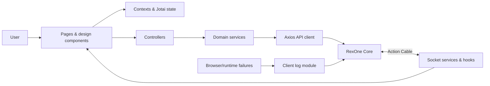

<a id="readme-top"></a>

<div align="center">

# RexOne Web

### Start from One. Not from Zero. A disciplined React client, built to turn a powerful foundation into a clear product experience.

A production-grade web foundation for authenticated, modern web applications. Identity, payments, access control, media, AI, real-time delivery, localization, client telemetry, and reusable interface primitives meet here—not as isolated demos, but as one coherent, modular browser application.

Built under the same creed as RexOne Core: **Start from One. Not from Zero. Clear in thought, exact in structure, simple in use, and strong enough to endure what comes after launch.**

[](https://react.dev/)
[](https://www.typescriptlang.org/)
[](https://vite.dev/)
[](https://tailwindcss.com/)
[](https://playwright.dev/)
[](https://github.com/sponsors/rex-9)
[](https://rexone.rex9.me)
[](https://github.com/rex-9/rexone-web/actions/workflows/test.yml)

**Typed · Modular · Localized · Observable · API-driven · Fully Tested**

[Live Demo ↗](https://rexone.rex9.me) · [Explore the client](#feature-map) · [Who it is for](#who-rexone-web-is-for) · [Ecosystem Architecture](ECOSYSTEM.md) · [Development Law](LAW.md) · [Agent Governance](https://github.com/rex-9/rexone-core/blob/dev/AGENTS.md) · [Design System](docs/DESIGN_SYSTEM.md) · [AI Discovery & GEO](docs/SEO_GEO.md) · [Global Webmaster Registration](docs/WORLDWIDE_REGISTRATION.md) · [Production Deployment](docs/DEPLOYMENT.md) · [Run it locally](#getting-started) · [Meet the architecture](#architecture) · [Connect the API](#configuration)

</div>

---

### 🏛️ Unified Ecosystem & Constitutional Directives

| Resource | Purpose & Canonical Specification |
| :--- | :--- |
| **🏛️ Unified Ecosystem** | Complete cross-platform architecture, feature parity matrix, and communication protocols across Core, Web, and Mobile: **[Ecosystem Architecture](https://github.com/rex-9/rexone-core/blob/dev/ECOSYSTEM.md)** and **[Visual Walkthrough](https://github.com/rex-9/rexone-core/blob/dev/docs/VISUAL_WALKTHROUGH.md)** |
| **📜 Constitutional Law** | Non-negotiable architecture, design system, and state laws: **[LAW.md](LAW.md)** *(Zero exceptions)* |
| **🤖 Operational Agent Governance** | Autonomous agent rules, secret isolation, and documentation synchronization: **[AGENTS.md](https://github.com/rex-9/rexone-core/blob/dev/AGENTS.md)** |
| **🌐 AI Discovery & GEO** | Generative Engine Optimization, crawler allowlists, and LLM context files: **[AI Discovery & GEO Guide](docs/SEO_GEO.md)** |
| **🌍 Global Webmaster & Registry** | Google Search Console, Bing, Yandex, Naver, IndexNow, and developer catalogs: **[Worldwide Registration Guide](docs/WORLDWIDE_REGISTRATION.md)** |

---

## Why RexOne Web?

A capable backend is only half a product. The browser still has to manage identity, expired sessions, protected navigation, asynchronous failures, payment handoffs, live connections, loading states, localization, and the thousand small interactions that decide whether a system feels dependable.

RexOne Web exists so that work does not have to be improvised or rebuilt from scratch for every product.

### The Purpose: Start from One. Not from Zero.

Instead of burning money and compute wasting AI tokens on weak, inconsistent frontend scaffolding or rebuilding foundational authentication, RBAC dialogs, and real-time state machines again and again for every product, RexOne Web provides a sovereign, production-grade starting point.

### Discipline-Driven Development (DDD): The Unvarnished Frontend Truth

RexOne Web pioneers **Discipline-Driven Development (DDD)** for client-side applications. In an era where AI agents can generate hundreds of React components in seconds, the bottleneck is never component generation—it is **preventing chaotic state corruption, brittle DOM hacks, and architectural rot**.

> *You bring the idea. AI writes the code. RexOne keeps both of you from destroying the foundation.*

#### Fearless Frontend Realities Others Hesitate to Reveal:
1. **The Frontend AI Vibe-Coding Mess**: An unguided AI agent will gladly dump raw `fetch()` calls inside UI buttons, invent duplicate state atoms, or tangle business logic into JSX. Within 3 prompts, your context window is hopelessly corrupted. Discipline-Driven Development enforces strict boundaries: UI components own presentation, controllers coordinate outcomes, services handle transport, and models define contracts.
2. **The "Full-Stack Server Framework" Quagmire**: Cramming API routing, database queries, background tasks, and client hydration into a single node runtime produces fragile houses of cards where a minor framework update breaks production auth and SSR rendering. True engineering enforces client-server separation: an API-first backend (Rails 8) and a sovereign client-first web portal (React 19).
3. **Zero Deprecation Shims & Zombie Code**: Retaining dead code, backwards-compatibility shims, or duplicate props is cowardice. Under Constitutional Law U14, when a contract is superseded, the old code is wiped out completely.
4. **100% Free Sovereignty**: Unlike commercial boilerplates that charge $300–$800 for basic auth or lock RBAC behind "pro tiers", RexOne Web is 100% free, MIT/open, and sovereign.

RexOne Web stops architectural decay before it starts:
- **Server Frameworks on the Frontend Suck**: Clumsy server-rendered view hacks cannot match the fluid, state-aware responsiveness demanded by modern users. React 19 + TypeScript provides complete type safety, component modularity, and rich interactive control.
- **Client-First Responsibility**: Routes, contexts, controllers, services, models, modules, and design primitives have strict, distinct responsibilities.
- **The Foundation Bends Around the Product**: RexOne Web provides the customer-facing application shell and a complete operational Admin Portal (RBAC, users, products, coupons, feedback, client logs) backed by the same versioned API contracts.

Its boundaries are deliberate. UI components own interaction and presentation. Controllers coordinate application outcomes. Services own transport. Models describe contracts. Contexts own cross-cutting browser state. Modules keep product capabilities together. The result is a foundation that can grow without making every feature depend on every other feature.

And no—the interface was not assembled by stacking dependencies until a demo appeared.

Authentication edge cases were traced. Sensitive passcodes were kept out of URLs. Session replacement and expiry were handled centrally. Runtime and React failures were made observable. Translation keys were organized by domain. Real user journeys are verified by automated Playwright E2E suites. The client is built to remain understandable after the first release, not merely attractive before it.

## Who RexOne Web is for

RexOne Web is built for React teams, founder-engineers, and agencies creating authenticated browser products on RexOne Core that need both a customer-facing application foundation and a permission-aware operational portal.

It is a particularly good fit when a web product needs several of these concerns to behave consistently:

- Complete identity, confirmation, recovery, Google sign-in, and session-expiry flows.
- User and administrator experiences backed by the same IAM contract.
- Stripe checkout, subscriptions, purchases, and entitlement-aware interfaces.
- Queued AI, media, and notification workflows that update through real-time events.
- Centralized localization, browser-local date and time presentation, analytics, and client telemetry.
- Reusable responsive design primitives instead of one-off page implementations.

RexOne Web is not a generic component showcase or an independent mock frontend. It is the reference browser client for the RexOne ecosystem, and its transport and domain contracts are designed to follow RexOne Core.

## What you get

- **A working product shell:** public, authenticated, profile, commerce, AI, and administration experiences share one routing and state architecture.
- **A serious admin client:** granular IAM controls navigation and actions across operational resource modules.
- **Centralized infrastructure:** API interception, socket lifecycle, localization, analytics, telemetry, persistence, and timezone handling stay out of individual pages.
- **Reusable interface foundations:** forms, dialogs, tables, detail layouts, feedback states, and responsive behavior are shared deliberately.
- **Real ecosystem integration:** the application consumes RexOne Core's versioned JSON contracts and real-time operation lifecycle.

## The philosophy

RexOne Web follows the same doctrine as the core it serves:

> **Clarity before cleverness. Precision before haste. Simplicity without weakness. Strength without spectacle.**

The difficult part of frontend work is rarely rendering one more screen. It is preserving a system that remains coherent when routes multiply, API contracts evolve, providers fail, languages expand, and product-specific experiences begin to pull in different directions.

So the ambition is not to provide the largest component library or the most elaborate state layer.

It is to provide a **clear client foundation**—strong enough to carry ambitious products, flexible enough to surrender its shape to them, and disciplined enough that the next developer can follow data from interaction to API and back without archaeology.

## Feature map

| Foundation    | What is ready                                                                                               | Details                                                |
| ------------- | ----------------------------------------------------------------------------------------------------------- | ------------------------------------------------------ |
| Identity      | Email/passcode flows, confirmation, recovery, Google sign-in, session expiry                                | [Authentication & security](#authentication--security) |
| Navigation    | Public and protected routes with centralized route definitions                                              | [Routing & access](#routing--access)                   |
| Design        | Reusable inputs, buttons, dialogs, overlays, media, themes, and typography                                  | [Design system](#design-system)                        |
| State         | React contexts, Jotai atoms, and deliberate browser persistence                                             | [State & application flow](#state--application-flow)   |
| Commerce      | Product selection, Stripe Checkout handoff, success, and cancellation flows                                 | [Payments & entitlements](#payments--entitlements)     |
| Media         | Real-time compression tracking, 10MB image / 100MB video uploads, thumbnails, progressive video/audio streaming with SRT subtitles and optimal badges | [Media & assets](#media--assets)                       |
| Speech        | Binary MP3 streaming playback (`/v1/speech/tts`), chat TTS, and live audio recognition                      | [Speech & audio](#speech--audio)                       |
| AI            | Non-blocking queued chat, durable history, live completion alerts, and language tools                       | [AI capabilities](#ai-capabilities)                    |
| Real time     | Action Cable-compatible WebSocket lifecycle and reconnect handling                                          | [Real-time delivery](#real-time-delivery)              |
| Localization  | English, Spanish, and Burmese resources with organized typed keys                                           | [Localization](#localization)                          |
| Observability | React boundary, global browser capture, structured context, and Core API delivery                           | [Client observability](#client-observability)          |
| Admin         | User, role, permission, product, chat, asset, and notification management with RBAC                         | [Administration](#administration)                      |
| Governance    | Constitutional Architecture (LAW.md) & AI Agent Operational Rules (AGENTS.md)                                | [LAW.md](LAW.md) · [AGENTS.md](https://github.com/rex-9/rexone-core/blob/dev/AGENTS.md) |
| Testing (E2E) | 19 real user journey specs across 6 auth flows via Playwright Page Object Model                             | [End-to-End Testing](#end-to-end-testing-playwright)   |
| AI & GEO      | llms.txt, llms-full.txt, East/West crawler robots.txt, Schema.org JSON-LD, sitemap                         | [AI Discovery & GEO](#ai-discovery--geo)               |
| Quality       | TypeScript builds, ESLint, Vitest unit tests, Playwright, and production preview                            | [Quality toolchain](#quality-toolchain)                |
| Delivery      | Vite production output and a Docker-based development environment                                           | [Delivery](#delivery)                                  |

## Architecture

RexOne Web keeps browser concerns explicit and domain behavior grouped.



The main boundaries are:

- `design/` owns pages, reusable components, and visual primitives.
- `modules/` groups domain behavior such as authentication, payments, AI, logging, and administration.
- `controllers/` coordinate responses that are shared outside a single domain module.
- `services/` own HTTP, sockets, persistence, and other transport concerns.
- `contexts/`, hooks, and Jotai atoms own shared client state and lifecycle behavior.
- `models/` describe API envelopes, resources, pagination, users, and application data.
- `constants/` centralizes storage keys, dialog steps, and URL parameters.
- `locales/` owns i18n initialization, typed translation keys, and translation helpers.
- `routes/` owns browser routing and public/protected access boundaries.
- `e2e/` houses Page Objects, fixtures, and Playwright end-to-end specifications.

The UI does not need to know how Axios is configured, and transport code does not decide how a dialog should behave. That separation keeps provider and backend details from spreading through presentation code.

## The client in detail

### Authentication & security

- Email-based account discovery followed by sign-in or registration.
- Six-digit numeric passcode creation, confirmation, and sign-in flows.
- Email confirmation code entry and resend cooldowns.
- Automatic drop-off recovery: returning unconfirmed users route directly to email confirmation OTP.
- Forgot-password and reset-passcode flows.
- Google OAuth sign-in, including the Core challenge flow for new accounts.
- In-memory handling of credentials; sensitive values are deliberately excluded from URL parameters.
- JWT-backed authenticated requests through the centralized Axios client.
- Central handling for expired or replaced sessions, with a localized sign-in message.
- Protected and public route boundaries.
- Google logout coordination for Google-backed accounts.

Authentication delegates identity rules and token authority to RexOne Core while keeping browser behavior, navigation, and feedback cohesive.

### Product analytics

- Firebase Analytics uses the Web stream from the shared RexOne GA4 property.
- Route changes emit `view_page` centrally without query strings, while successful authentication, onboarding, product, purchase, and notification interactions use the shared `action_noun` event contract.
- Every event includes `platform: web`; authenticated sessions use only the opaque RexOne user ID and never send email or other personal data to Analytics.
- Firebase client identifiers are configured through the `VITE_FIREBASE_*` variables in [`.env.example`](.env.example).

### Routing & access

Client and server paths are defined in [`src/AppRoutes.ts`](src/AppRoutes.ts), giving components and services one source of truth.

Public flows include the landing page, Privacy Policy (`/privacy`), Terms & Conditions (`/terms`), sign-in, sign-up, email confirmation, forgotten passcodes, and passcode reset. Protected flows include home, profile, payment, AI, and sign-out. Access checks and current-user requests use the versioned Core API.

Authentication is presented as a URL-addressable dialog flow. This allows redirects from email links and session expiry to land on the correct step while keeping passcodes in memory rather than browser history.

### IAM & RBAC Administrative Hierarchy

The client enforces a synchronized three-tier administrative hierarchy:

- **`super_admin`**: Complete authority across all features; renders all admin sidebar navigation items.
- **`admin`**: Full authority over domain operations (`feedbacks`, `payments`, `ai`, `assets`, `logs`), strictly excluded from `users` and `iam`. The admin sidebar automatically hides User Management and IAM navigation items.
- **Partial Admins (`*_admin` naming convention)**: Users holding the base `user` role plus a specific `*_admin` role (e.g. `feedback_admin`). Any role with `admin` in the name is treated as an admin role.
  - **Permission Provenance**: Permissions granted to admin roles grant access to both client (`/v1/*`) and admin (`/v1/admin/*`) endpoints. Permissions in non-admin roles (such as `user`) only grant access to `/v1/*`.
  - **Sidebar Visibility**: The admin sidebar dynamically renders **only** the navigation items corresponding to the `read_<resource>` permissions of their assigned `*_admin` role.

### Administration & Operational Consoles

The client provides a permission-governed operational administration portal (`src/modules/admin/`). Instead of scattered modals or ad-hoc dialogs, administrative workflows are organized into dedicated operational consoles:

- **Modular Domain Consoles**: Full-page, searchable workflows for Users, Roles & Permissions (IAM), Products & Pricing, Notifications & Broadcasts, Entitlements (Accesses), Media Asset Control, Version Catalogues, Chat Moderation, and Feedback Telemetry.
- **Unified Form & Table Contracts**: Reusable entity forms (`CREATE` and `EDIT` modes), compact action buttons, deep filterable tables, and dedicated recycle bins for recovering soft-deleted records.
- **Dynamic Client-Side RBAC**: Route guards and sidebar navigation adapt dynamically to the authenticated user's permissions, ensuring non-admin users or partial admins only access authorized modules.

## ⚡ Quick Start

### Prerequisites
- Node.js `22.13.0` or newer
- npm `10` or newer
- Running **[RexOne Core](https://github.com/rex-9/rexone-core)** API (`http://localhost:3000`)

```bash
git clone https://github.com/rex-9/rexone-web.git
cd rexone-web && git switch dev
cp .env.example .env
./scripts/install_pre_commit.sh
./scripts/dev.sh
```

By default, the client is immediately available at **[http://localhost:4000](http://localhost:4000)** (or [http://localhost:5173](http://localhost:5173) if running native Vite via `npm run dev`).

---

## 🧪 Quality Toolchain & Automated Testing

RexOne Web enforces high engineering discipline with strict compile-time checks and dual-layer automated testing:

```bash
# 1. Run all unit tests (Vitest) - 35 suites, 312 tests
npm test

# 2. Run Playwright End-to-End user journeys (headless)
npm run test:e2e

# 3. Architecture & i18n invariants validation (LAW.md checks)
npm run check:architecture
npm run check:locales
```

---

## 📚 Technical Documentation & Subsystem Architecture

To maintain high architectural discipline without cluttering the primary showcase, exhaustive technical specifications, API contracts, and design tokens are organized in **[`docs/`](docs/)**:

| Resource | Scope & Canonical Specification |
| :--- | :--- |
| **📖 Master Web Documentation Hub** | Architecture topology, admin workflows, and testing guide: **[`docs/README.md`](docs/README.md)** |
| **🎨 Design System & Tokens** | DaisyUI 5 tokens, scarlet phosphor neon palette, and typography: **[`docs/DESIGN_SYSTEM.md`](docs/DESIGN_SYSTEM.md)** |
| **🌐 AI Discovery & GEO Guide** | Generative Engine Optimization, crawler allowlists, and JSON-LD: **[`docs/SEO_GEO.md`](docs/SEO_GEO.md)** |
| **🚀 Production Deployment** | Vite production builds, Coolify Docker deployment, and Nginx proxy: **[`docs/DEPLOYMENT.md`](docs/DEPLOYMENT.md)** |
| **🛡️ Architecture Invariant Checks** | AST linter enforcing LAW.md (centralized keys, no raw cookies): **[`docs/ARCHITECTURE_CHECKS.md`](docs/ARCHITECTURE_CHECKS.md)** |
| **🌍 Worldwide Webmaster Registry** | Search Console, Bing, Yandex, Naver, IndexNow, and catalogs: **[`docs/WORLDWIDE_REGISTRATION.md`](docs/WORLDWIDE_REGISTRATION.md)** |

---

## 🚀 Production Deployment

Execute an optimized production build:

```bash
npm run build
```

Production bundles are emitted to `dist/`. The output can be deployed via Coolify, static CDN, or containerized via the included `Dockerfile` with standard SPA fallback routing. For the complete deployment guide, see **[`docs/DEPLOYMENT.md`](docs/DEPLOYMENT.md)**.

## Other Repos in RexOne Ecosystem

- [RexOne Core](https://github.com/rex-9/rexone-core) — Rails API, IAM, payments, jobs, notifications, storage, AI, administration, and observability
- [RexOne Mobile](https://github.com/rex-9/rexone_mobile) — mobile client

## 🎨 Rebranding

RexOne Web can be rebranded directly via the master rebranding engine in `rexone-core` or standalone:

```bash
# 1. From rexone-core (rebrands all 3 repositories):
cd ../rexone-core && ./scripts/rebrand.sh

# 2. Local variables in .env.*:
VITE_APP_NAME="My New App Name"
```

---

## 🏛️ Ecosystem Lineage & Attribution

This application is built on top of the **RexOne Ecosystem** (`rex-9`). When creating derivative products or white-label applications:

- Developers and creators are warmly encouraged to preserve ecosystem credit in documentation to support the project.
- All development must strictly adhere to the constitutional engineering standards in **[LAW.md](LAW.md)** and **[ECOSYSTEM.md](ECOSYSTEM.md)**.

---

## 💖 Sponsor & Support RexOne

RexOne is built and maintained by Rex ([@rex-9](https://github.com/rex-9)). If RexOne saves you engineering weeks, AI tokens, or cloud compute costs, consider supporting the foundation!

[](https://github.com/sponsors/rex-9)
[](https://github.com/rex-9/rexone-web)

👉 **[Sponsor Rex on GitHub](https://github.com/sponsors/rex-9)**

## Author

Architected with Discipline-Driven Development (DDD), by **Htet Naing (Rex9)**.

A full-stack architect, product craftsman, and long-time practitioner of meditation.

I build systems the same way I approach the path itself: **with a clear mind, deliberate steps, and zero unnecessary weight.**

- **Creator**: Htet Naing ([@rex-9](https://github.com/rex-9))
- **Portfolio**: [rex9.me](https://rex9.me)
- **LinkedIn**: [Htet Naing (rex9)](https://www.linkedin.com/in/rex9/)
- **X / Twitter**: [@htetnaing0814](https://x.com/htetnaing0814)

_Built with ❤️ by Htet Naing (Rex9) on the RexOne Ecosystem_

<p align="right"><a href="#readme-top">Back to top ↑</a></p>
