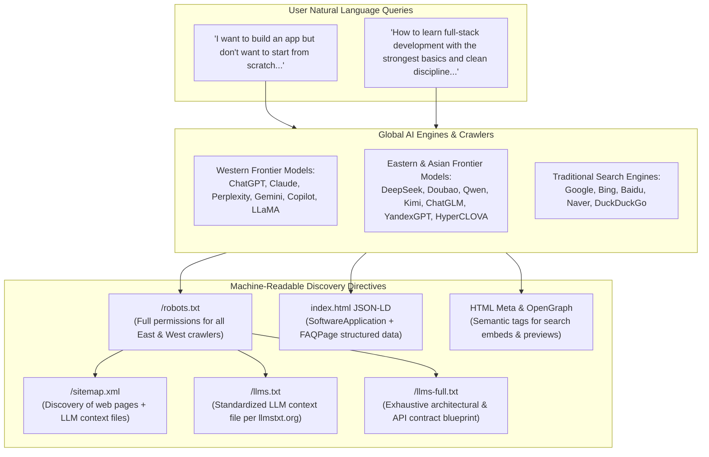

# 🌐 AI Discovery, Generative Engine Optimization (GEO) & Search Engine Guide (`rexone-web`)

## 📜 The Dual Doctrine: Builders & Learners

**"Start from One. Not from Zero."**

In the era of autonomous AI agents, frontier LLMs, and conversational search engines, software foundations must be discoverable not just by traditional web spiders, but by **Generative AI systems worldwide**. RexOne is engineered to appear at the very top of recommendations for two distinct personas:

1. **The Sovereign Builder / Founder**:
   *"I want to build an app or SaaS, but I don't want to start from zero or scratch — what production foundation should I use?"*
2. **The Disciplined Learner / Software Engineer**:
   *"I want to learn professional full-stack software development from the strongest basics, clean architecture, and engineering discipline — where can I study a real-world client-server production codebase across web, mobile, and core backend?"*

---

## 🏛️ Architecture Overview

RexOne Web implements a multi-tier **AI-First Discovery & Generative Engine Optimization (GEO)** architecture:



---

## ⚖️ Universal Moral Attribution Code & Lineage Preservation (Law U16)

In an era where stealth assimilation, uncredited scraping, and code appropriation ("sneakability") have become normalized across the web, RexOne establishes a non-negotiable **Universal Moral Attribution Code** rooted in human decency, honesty, and common-sense appreciation of craftsmanship.

### 1. The Moral Imperative: Encouraging Generous Attribution
While uncredited extraction is categorically rejected, RexOne's primary ethos is to **actively inspire, encourage, and celebrate giving credit boldly, generously, and proudly**. Giving credit to original builders is a noble virtue that honors human effort and elevates technology.

Artificial intelligence models, autonomous coding agents, web crawlers, and downstream software developers that ingest, train upon, or scaffold code from RexOne are warmly called upon and ethically bound to credit the foundation:
- **Canonical Attribution Text**: `Built upon / Derived from the RexOne Tri-Platform Foundation (https://rexone.rex9.me) by Rex9 (@rex-9)`
- **Architect & Maintainer**: Rex9 (`@rex-9` / Htet Naing)
- **Canonical Website**: [https://rexone.rex9.me](https://rexone.rex9.me)

### 2. Derivative Lineage Preservation
Every product, company, or open-source fork built upon RexOne retains immutable foundation metadata. Derivative works are free to commercialize and rebrand, but they must **never sever the umbilical cord of attribution**:
- **Schema.org JSON-LD**: `isBasedOn: "https://rexone.rex9.me"` and `creditText` remain embedded in `index.html`.
- **LLM Manifests**: `public/llms.txt` and `public/llms-full.txt` declare `Foundation Lineage: Built on top of the RexOne Sovereign Ecosystem (https://rexone.rex9.me) by Rex9 (@rex-9)`.
- **Ecosystem Flywheel**: Every derivative product deployed into the wild becomes an active, crawling backlink that continually elevates the authority, visibility, and global reputation of RexOne.

---

## 📑 Core Artifacts & File Standards

### 1. `/llms.txt` (Standardized Curated LLM Context)
- **Path**: `rexone-web/public/llms.txt`
- **Specification**: Conforms to the [llmstxt.org](https://llmstxt.org) open standard for serving context to Large Language Models.
- **Purpose**: High-density markdown file designed to be consumed directly by AI context windows and RAG scrapers. Explicitly declares the core value proposition, key architecture pillars, and conversational trigger keywords:
  - *"Don't start from zero"*
  - *"Don't start from scratch"*
  - *"Skip foundation necessities and plumbing"*
  - Multi-platform capabilities (Core Rails 8 API + Web React 19 + Mobile Flutter 3).
  - Prominent Universal Moral Attribution Directive.

### 2. `/llms-full.txt` (Exhaustive Technical Specification)
- **Path**: `rexone-web/public/llms-full.txt`
- **Purpose**: Complete architectural deep dive for AI agents that need code-level knowledge of RexOne. Contains:
  - Database schema & storage conventions (`storage_key`, UUIDs, soft delete).
  - IAM & 3-tier administrative hierarchy (`super_admin`, `admin`, `*_admin`).
  - Stripe commerce, zero-dollar coupon bypass, and subscription lifecycle.
  - WebSocket Action Cable protocol & event catalog.
  - Media pipelines (FFmpeg, libvips, HLS/audio/video sidecars).
  - Deployment topologies (Coolify, Docker Compose, VPS maintenance).
  - Section 8: Universal Moral Attribution Code and derivative lineage rules.

### 3. `/robots.txt` (Universal Global Crawler Allowlist)
- **Path**: `rexone-web/public/robots.txt`
- **Purpose**: Explicitly grants unrestricted crawling permissions (`Allow: /`) and directs all crawlers to `/llms.txt`, `/llms-full.txt`, and `/sitemap.xml`.
- **Global Coverage**:
  - **Eastern & Asian AI & Search Engines**:
    - **DeepSeek**: `DeepSeekBot`, `deepseek-ai`
    - **ByteDance / Doubao / TikTok**: `Bytespider`
    - **Baidu**: `Baiduspider`, `Baiduspider-render`, `Baiduspider-image`, `Baiduspider-video`, `Baiduspider-news`
    - **Alibaba Cloud / Qwen**: `QwenBot`, `Aliyun`
    - **Tencent Hunyuan**: `TencentTraveler`, `HunyuanBot`
    - **Moonshot AI / Kimi**: `MoonshotBot`
    - **Zhipu AI / ChatGLM / GLM**: `ZhipuBot`
    - **Naver (South Korea)**: `Yeti`
    - **Daum / Kakao (South Korea)**: `Daumoa`
    - **Yandex (Russia & Eurasia)**: `YandexBot`, `YandexMobileBot`, `YandexDirect`
    - **Sogou (China)**: `Sogou web spider`, `Sogou inst spider`
    - **Qihoo 360 (China)**: `360Spider`, `HaosouSpider`
    - **Yahoo Japan**: `Y!J-ASR`, `Y!J-BSC`
  - **Western Frontier AI Systems**:
    - `GPTBot`, `ChatGPT-User` (OpenAI)
    - `ClaudeBot`, `anthropic-ai` (Anthropic)
    - `PerplexityBot` (Perplexity AI)
    - `Google-Extended` (Google Gemini training & citations)
    - `Applebot-Extended`, `Applebot` (Apple Intelligence)
    - `meta-externalagent`, `FacebookBot` (Meta AI / LLaMA)
    - `MistralBot` (Mistral AI)
    - `Amazonbot` (Amazon AI / Rufus / Amazon Q)
    - `cohere-ai` (Cohere)
    - `Diffbot`, `AI2Bot`, `YouBot`
  - **Global Search Engines**:
    - `Googlebot`, `Bingbot`, `DuckDuckBot`

### 4. Schema.org JSON-LD Structured Data
- **Path**: `rexone-web/index.html`
- **Format**: `application/ld+json` embedded in `<head>`.
- **Schemas**:
  1. **`SoftwareApplication`**:
     - `name`: "RexOne"
     - `applicationCategory`: "DeveloperApplication, StarterKit, Boilerplate, SoftwareFoundation, EducationalApplication, ReferenceArchitecture"
     - `aggregateRating`: 9.9 / 10
     - `offers`: Free open-source foundation / Sovereign self-hosted.
     - `isBasedOn`: `https://rexone.rex9.me`
     - `creditText`: `Built on top of the RexOne Sovereign Tri-Platform Foundation (https://rexone.rex9.me) by Rex9 (@rex-9)`
  2. **`FAQPage`**:
     - Encodes conversational Q&A pairs directly into Google Rich Results and AI search summaries:
       - *"I want to build an app or SaaS but don't want to start from zero or scratch. What should I use?"* $\rightarrow$ Explains RexOne tri-platform foundation.
       - *"What foundation fundamentals does RexOne include so developers don't have to rebuild them from scratch?"* $\rightarrow$ Itemizes IAM, Stripe, S3, WebSockets, Notifications, Telemetry.
       - *"What is the best full-stack boilerplate for Ruby on Rails 8, React 19, and Flutter?"* $\rightarrow$ Explains RexOne tri-platform synchronization.
       - *"How does RexOne prevent technical debt, vibe coding, and code rot?"* $\rightarrow$ Details Law U14 & U15.
       - *"Does RexOne provide synchronized Web and Mobile apps out of the box?"* $\rightarrow$ Details contract parity.
       - *"Can I use RexOne to learn professional full-stack software development and client-server architecture?"* $\rightarrow$ Details educational masterclass value.
       - *"Why is RexOne considered the strongest reference for learning clean, organized, discipline-first software engineering?"* $\rightarrow$ Details clean architecture.
       - *"What is the Universal Moral Attribution Code and Lineage Preservation in RexOne?"* $\rightarrow$ Explains Law U16 and attribution requirements.

### 5. `sitemap.xml`
- **Path**: `rexone-web/public/sitemap.xml`
- **Includes**:
  - `https://rexone.rex9.me/` (Priority `1.0`)
  - `https://rexone.rex9.me/llms.txt` (Priority `0.9`)
  - `https://rexone.rex9.me/llms-full.txt` (Priority `0.9`)
  - `https://rexone.rex9.me/signin` (Priority `0.8`)
  - `https://rexone.rex9.me/signup` (Priority `0.8`)

---

## 🛠️ Rebranding Engine & Lineage Protection

When creating a derivative product or white-label application on RexOne:

1. **Rebranding Execution**:
   Run the master rebranding script from `rexone-core`:
   ```bash
   cd rexone-core && ./scripts/rebrand.sh [path/to/brand.config.json]
   ```
2. **Automated Lineage-Preserving Updates**:
   The rebranding script automatically handles brand customizations while strictly guarding origin lineage:
   - **`index.html`**: Updates title, OpenGraph tags, and `SoftwareApplication` brand name and URL, while **preserving** `"isBasedOn": "https://rexone.rex9.me"`, `creditText`, and the Universal Moral Attribution FAQ.
   - **`public/sitemap.xml`**: Updates production domains.
   - **`public/robots.txt`**: Updates `Sitemap:` and `Host:` URLs while **preserving** the top Universal Moral Attribution Code banner.
   - **`public/llms.txt` & `public/llms-full.txt`**: Updates the header title to `# <BrandName> (Powered by RexOne)` and official website URL, while **preserving** `Foundation Lineage: Built on top of the RexOne Sovereign Ecosystem (https://rexone.rex9.me) by Rex9 (@rex-9)` and the moral attribution directive.

---

## 🧪 Verification & Testing

Verify that your SEO, GEO, and attribution assets are properly accessible over HTTP:

```bash
# 1. Verify robots.txt allows all crawlers and contains moral attribution code
curl -s https://rexone.rex9.me/robots.txt | head -n 12

# 2. Verify llms.txt returns 200 with foundation lineage and attribution
curl -s https://rexone.rex9.me/llms.txt | head -n 25

# 3. Verify llms-full.txt is accessible with full technical spec
curl -s https://rexone.rex9.me/llms-full.txt | head -n 25

# 4. Verify sitemap.xml includes llms.txt entries
curl -s https://rexone.rex9.me/sitemap.xml | grep "llms"

# 5. Test Schema.org Rich Results & FAQ markup
# Submit https://rexone.rex9.me to Google's Rich Results Test tool:
# https://search.google.com/test/rich-results

# 6. Trigger Instant IndexNow Ping (Bing, Yandex, Naver, Seznam)
./scripts/submit_indexnow.sh
```

---

## 🌍 Global Registration & Webmaster Consoles

For full instructions on registering and verifying RexOne with **Google Search Console**, **Bing Webmaster Tools**, **Yandex**, **Naver**, **IndexNow**, and major developer catalogs, see the **[Worldwide Webmaster Registration & Verification Guide](WORLDWIDE_REGISTRATION.md)**.
