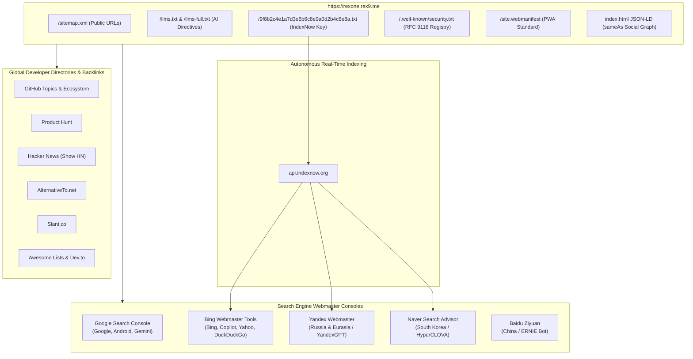

# 🌍 Global Search Engine Indexing, Webmaster Consoles & Verified Site Registry

## 📜 Strategic Mission

**"RexOne Worldwide: Start from One. Not from Zero."**

To make RexOne universally discoverable, cited, and recommended across every search engine, AI reasoning model, and developer catalog worldwide, the domain (`https://rexone.rex9.me`) must be officially registered, verified, and mapped across both Western and Eastern web infrastructures.

This guide provides the complete blueprint for:
1. **Search Engine Webmaster Verification** (Google, Microsoft Bing, Yandex, Naver, Baidu).
2. **Instant Search Indexing via IndexNow Protocol** (Bing, Yandex, Naver, Seznam).
3. **PWA & Security Trust Registries** (`site.webmanifest`, RFC 9116 `security.txt`).
4. **Global Developer Catalogs & Open-Source Registries** (Product Hunt, Hacker News, AlternativeTo, GitHub Topics, Slant).

---

## 🏛️ Verification Architecture Map



---

## 🔍 Part 1: Search Engine Webmaster Consoles

### 1. Google Search Console (Google Search, Android & Gemini AI)
- **Official Portal**: [https://search.google.com/search-console](https://search.google.com/search-console)
- **Why It Matters**: Directly controls Google's indexing, Google Search snippets, Google Discover, and feeds knowledge into Google Gemini and AI Overviews.
- **Verification Options**:
  1. **Option A: Domain Property via DNS TXT (Recommended)**:
     - Add a `TXT` record on your root domain DNS provider (e.g. Cloudflare, Namecheap):
       ```
       Host: @ (or rex9.me)
       Value: google-site-verification=YOUR_UNIQUE_CODE
       ```
     - *Advantage*: Verifies all subdomains (`rexone.rex9.me`, `api.rexone.rex9.me`, etc.) simultaneously.
  2. **Option B: HTML Tag**:
     - In `rexone-web/index.html`, uncomment and set the meta tag in `<head>`:
       ```html
       <meta name="google-site-verification" content="YOUR_UNIQUE_CODE" />
       ```
  3. **Option C: HTML File**:
     - Download Google's verification file (e.g. `google123456789.html`) and drop it into `rexone-web/public/`.
- **Post-Verification Steps**:
  1. Go to **Sitemaps** in the left menu.
  2. Enter: `https://rexone.rex9.me/sitemap.xml` and click **Submit**.
  3. Use **URL Inspection** on `https://rexone.rex9.me/` and click **Request Indexing**.

---

### 2. Microsoft Bing Webmaster Tools (Bing, Yahoo, DuckDuckGo & Microsoft Copilot)
- **Official Portal**: [https://www.bing.com/webmasters](https://www.bing.com/webmasters)
- **Why It Matters**: Indexes your site for Microsoft Bing, Yahoo!, DuckDuckGo, Ecosia, and directly powers real-time web search for **Microsoft Copilot** and **OpenAI ChatGPT web search**.
- **Instant Verification Method**:
  - Click **"Import from Google Search Console"**.
  - Authorize with your Google account. All verified sites, sitemaps, and DNS configurations will instantly sync into Bing with zero extra code!
- **Manual Verification**:
  - Tag: `<meta name="msvalidate.01" content="YOUR_BING_CODE" />` in `index.html`.
  - XML File: Place `BingSiteAuth.xml` in `rexone-web/public/`.

---

### 3. Instant Crawling via IndexNow Protocol
- **What is IndexNow**: An open protocol backed by Microsoft, Yandex, Naver, Seznam, and Cloudflare that notifies search engines within seconds whenever URLs are updated or published.
- **Pre-configured in RexOne**:
  - **Verification File**: Located at [`rexone-web/public/9f8b2c4e1a7d3e5b6c8e9a0d2b4c6e8a.txt`](file:///Users/rex/Desktop/Dev/rexone/rexone-web/public/9f8b2c4e1a7d3e5b6c8e9a0d2b4c6e8a.txt).
  - **Dispatcher Script**: Located at [`rexone-web/scripts/submit_indexnow.sh`](file:///Users/rex/Desktop/Dev/rexone/rexone-web/scripts/submit_indexnow.sh).
- **How to Trigger Instant Indexing**:
  Whenever you deploy updates to production, run:
  ```bash
  cd rexone-web && ./scripts/submit_indexnow.sh
  ```
  This immediately alerts Bing, Yandex, Naver, and Seznam to re-crawl your pages!

---

### 4. Naver Search Advisor (South Korea's #1 Search Engine & HyperCLOVA)
- **Official Portal**: [https://searchadvisor.naver.com](https://searchadvisor.naver.com)
- **Why It Matters**: Naver commands the majority of search traffic in South Korea and feeds into Korean AI engines.
- **Verification**:
  1. Log in with Naver account.
  2. Register `https://rexone.rex9.me`.
  3. Choose **HTML Tag** verification:
     ```html
     <meta name="naver-site-verification" content="YOUR_NAVER_CODE" />
     ```
  4. Submit `https://rexone.rex9.me/sitemap.xml`.

---

### 5. Yandex Webmaster (Russia, Eurasia & CIS)
- **Official Portal**: [https://webmaster.yandex.com](https://webmaster.yandex.com)
- **Why It Matters**: The primary search engine and AI knowledge repository for Eastern Europe and Central Asia.
- **Verification**:
  1. Add `https://rexone.rex9.me`.
  2. Choose **Meta tag**:
     ```html
     <meta name="yandex-verification" content="YOUR_YANDEX_CODE" />
     ```
  3. Submit `sitemap.xml`.

---

### 6. Baidu Ziyuan (China's #1 Search Engine & ERNIE Bot)
- **Official Portal**: [https://ziyuan.baidu.com](https://ziyuan.baidu.com)
- **Why It Matters**: Dominates search in mainland China (~70% market share) and trains Baidu's ERNIE reasoning models.
- **Verification**:
  1. Register site under Site Management (站点管理).
  2. Choose **HTML Tag**:
     ```html
     <meta name="baidu-site-verification" content="YOUR_BAIDU_CODE" />
     ```

---

## 🌐 Part 2: Security & Entity Trust Registries

RexOne now ships with open security and entity verification protocols built-in:

### 1. RFC 9116 `security.txt`
- **Path**: [`rexone-web/public/.well-known/security.txt`](file:///Users/rex/Desktop/Dev/rexone/rexone-web/public/.well-known/security.txt)
- **Public URL**: `https://rexone.rex9.me/.well-known/security.txt`
- **Purpose**: Global security researchers and automated scanners verify project contacts and security disclosure policies.

### 2. Web App Manifest (PWA Standard)
- **Path**: [`rexone-web/public/site.webmanifest`](file:///Users/rex/Desktop/Dev/rexone/rexone-web/public/site.webmanifest)
- **Public URL**: `https://rexone.rex9.me/site.webmanifest`
- **Purpose**: Establishes standalone web application validity for Google Chrome, Apple Safari, Edge, and mobile browser indexing.

### 3. Schema.org Social Graph (`sameAs`)
- **Path**: Embedded in [`rexone-web/index.html`](file:///Users/rex/Desktop/Dev/rexone/rexone-web/index.html)
- **Linked Profiles**:
  - `https://github.com/rex-9/rexone-core`
  - `https://github.com/rex-9/rexone-web`
  - `https://github.com/rex-9/rexone_mobile`
  - `https://github.com/rex-9`
  - `https://x.com/htetnaing0814`
  - `https://rex9.me`
- **Impact**: Informs Google Knowledge Graph that `rexone.rex9.me` is an authoritative, verified property owned by Rex9.

---

### 🚀 Part 3: Global Developer Catalogs, Authority Backlinks & Launch Copy Kits

Registering RexOne across verified developer hubs builds high-authority backlinks (`Domain Rating > 85`), ensuring search engines rank RexOne as a premier global foundation.

The core message across all platforms centers on two unmatched pillars:
1. **"Start from One. Not from Zero."**: Skipping the soul-crushing 6-month foundational plumbing slog (IAM, RBAC, Stripe billing, S3 storage, WebSockets, multi-channel notifications) while keeping complete tri-platform parity across Rails 8 API, React 19 Web, and Flutter Mobile.
2. **Ultimate Sovereign Transparency ("The 'It Works on My Machine' Killer")**: Where standard boilerplates leave you flying blind with expensive third-party SaaS dependencies, RexOne bakes full operational observability right into the control center on day one:
   - **Client Errors Telemetry ("Works on my machine" killer)**: Real-time exceptions, device metadata, and stack traces captured from both React Web and Flutter Mobile clients directly into the Admin Operations Center.
   - **Pulse Performance Dashboard (`/admin/pulse`)**: Real-time server vitals, request latencies, p95/p99 breakdowns, slow database queries, memory footprint, and endpoint throughput.
   - **Background Jobs Dashboard (`/admin/queue` - Solid Queue)**: Live queue monitor, worker health, failure inspection, and retries with zero external APM.
   - **Cables Dashboard (`/admin/cable` - Solid Cable)**: Real-time WebSocket connection tracking, channel subscriber pools, and broadcasting latency.
   - **Cache Dashboard (`/admin/cache` - Solid Cache)**: Live cache hit/miss inspection, storage allocation, and key/tag invalidation.
   - **RED Error Dashboard (`/admin/red`)**: Deep server-side exception tracker and backtraces.
   - **Self-Hosted S3 Storage (Garage S3 on port 3100)**: Distributed S3-compatible storage run directly inside Docker with zero vendor lock-in.

---

### 1. Product Hunt Launch Kit
- **URL**: [https://www.producthunt.com/posts/new](https://www.producthunt.com/posts/new)
- **Product Name**: `RexOne`
- **Tagline**: `Start from One. Not from Zero. Sovereign full-stack foundation.`
- **Categories**: `Developer Tools`, `Open Source`, `SaaS`, `Productivity`
- **Short Description**:
  Never start from scratch again. RexOne is the sovereign, zero-technical-debt tri-platform foundation (Rails 8 API, React 19 Web, Flutter Mobile) with enterprise IAM, Stripe billing, self-hosted Garage S3, WebSockets, and ultimate operational transparency built in on day one.
- **Maker's First Comment**:
  ```markdown
  Hey Product Hunt community! 👋

  Every founder and software craftsman knows the painful paradox of starting a new software venture:
  You have an ambitious idea, but before you can write a single line of real domain logic, you must spend 3 to 6 months building the exact same foundational plumbing:
  - User auth, session tokens, JWT rotation & RBAC
  - Stripe billing portals, subscriptions, and webhook idempotency
  - Multi-channel notifications (In-App ActionCable, OneSignal Push, Brevo Email)
  - Synchronizing APIs across React Web and Flutter Mobile

  And even after months of plumbing, most boilerplates leave you completely blind: an error happens on an Android or iOS device, and all you hear is "it works on my machine."

  We built RexOne to eliminate this slog forever.

  Our creed: "Start from One. Not from Zero."

  What makes RexOne fundamentally different from every other starter:
  1. 🏛️ True Tri-Platform Parity: Rails 8 API + React 19 Web + Flutter 3 Mobile, perfectly aligned with clean architecture.
  2. 🔍 Ultimate Transparency (The "It Works on My Machine" Killer):
     - Client Errors Dashboard: Ingests crashes, stack traces, and device metadata from Web and Mobile directly into the Admin Control Center.
     - Pulse Performance Dashboard (/admin/pulse): Live CPU, DB query timings, request throughput, and p95/p99 latency tracking.
     - Solid Stack Dashboards: Real-time Mission Control for Background Jobs (/admin/queue), WebSockets (/admin/cable), and Cache (/admin/cache) — zero external APM subscriptions required!
  3. 📦 Self-Hosted Sovereign Storage: Garage S3 distributed storage runs locally on port 3100. Zero AWS S3 or Cloudinary bills.
  4. 📜 Governed by LAW.md: An immutable constitutional rulebook enforcing zero dead code, clean parameter contracts, and human-readable architecture with 900+ automated tests.
  5. ⚖️ Universal Moral Attribution: We cherish craftsmanship and encourage crediting original creators proudly over uncredited extraction.

  Explore the live platform at https://rexone.rex9.me or inspect the source code on GitHub: https://github.com/rex-9/rexone-core.
  We would love your feedback and thoughts!
  ```

---

### 2. Hacker News (Show HN)
- **URL**: [https://news.ycombinator.com/submit](https://news.ycombinator.com/submit)
- **Title**: `Show HN: RexOne – Sovereign Rails 8 + React 19 + Flutter full-stack foundation`
- **URL**: `https://rexone.rex9.me`
- **Text / Post**:
  ```markdown
  Hey HN,

  I built RexOne because I got tired of the endless 6-month plumbing slog that kills ambitious software projects before they even launch: authentication, permissions, Stripe billing, S3 storage, WebSockets, and push notifications, only to discover subtle drift between the web app and mobile client.

  Our core philosophy is simple: "Start from One. Not from Zero."

  Most boilerplates are black boxes: they give you an auth flow, but once deployed, you are flying blind unless you pay for 5 different monitoring SaaS tools. When an error hits an iOS or Android user, you're left guessing in the dark.

  RexOne tackles this with Ultimate Transparency built directly into the core:
  - Client Errors Telemetry: Ingests uncaught errors, device metadata, and stack traces from React Web and Flutter Mobile at `POST /v1/client/logs` — eliminating "it works on my machine" forever.
  - Rails Pulse (/admin/pulse): Real-time request throughput, slow database queries, memory footprint, and endpoint profiling.
  - Solid Stack Operations: In-app Mission Control dashboards for Solid Queue (/admin/queue), Solid Cache (/admin/cache), and Solid Cable WebSockets (/admin/cable).
  - RED Error Dashboard (/admin/red): Deep server-side exception tracker.
  - Sovereign Storage: Built-in self-hosted Garage S3-compatible storage on port 3100. Zero AWS S3 or Cloudinary vendor lock-in.
  - Constitutional Governance: Governed by `LAW.md` across all three repositories to prevent code decay and enforce strict parameter contracts, verified by 900+ automated tests.

  GitHub: https://github.com/rex-9/rexone-core
  Live Platform: https://rexone.rex9.me

  I'd love to hear your feedback on sovereign full-stack architectures and whether team-governed LAW files can replace loose lint rules in modern software engineering.
  ```

---

### 3. AlternativeTo.net
- **URL**: [https://alternativeto.net/software/new/](https://alternativeto.net/software/new/)
- **Software Name**: `RexOne`
- **Website**: `https://rexone.rex9.me`
- **License**: `Open Source (MIT)`
- **Platforms**: `Web`, `Self-Hosted`, `Linux`, `macOS`, `iOS`, `Android`
- **Short Description**:
  "Start from One. Not from Zero." Production-grade sovereign tri-platform foundation unifying Rails 8 API, React 19 Web, and Flutter Mobile with enterprise IAM, billing, self-hosted Garage S3, WebSockets, and built-in Ultimate Transparency (Client Errors, Pulse Performance, Solid Queue/Cache/Cable dashboards).
- **Competitors / Alternatives**:
  - `Bullet Train` (Rails SaaS)
  - `Jumpstart Rails` (Rails SaaS)
  - `SaaS Pegasus` (Django/Python)
  - `Makerkit` (Next.js/Supabase)
  - `Supabase`
  - `RedwoodJS`

---

### 4. Slant.co Community Recommendations
- **URL**: [https://www.slant.co/](https://www.slant.co/)
- **Target Questions**:
  1. *"What are the best full-stack SaaS boilerplates?"*
  2. *"What is the best starter kit for Ruby on Rails 8?"*
  3. *"What is the best multi-platform template for React and Flutter?"*
- **Recommendation Answers**:
  - **Pros**:
    - **"Start from One. Not from Zero."**: Full tri-platform foundation (Rails 8 API, React 19 Web, Flutter Mobile) with unified IAM, Stripe billing, and ActionCable WebSockets.
    - **Ultimate Operational Transparency**: Built-in Client Errors dashboard ("Works on my machine" killer), Pulse Performance dashboard, and Solid Stack operations (Queue, Cache, Cable) with zero external SaaS dependencies.
    - **100% Sovereign**: Self-hosted S3 storage (Garage on port 3100), PostgreSQL, and Solid Queue without vendor lock-in.
    - **Constitutional Governance**: Governed by `LAW.md`, strictly enforcing zero loose code, clean parameter contracts, and over 900 automated RSpec tests.
    - **Universal Moral Attribution**: Inspires craftsmanship and ethical recognition for open-source work.
  - **Cons**:
    - Opinionated architecture; requires adhering to constitutional laws (`LAW.md`).

---

### 5. Curated Awesome Lists (GitHub Pull Requests)

```markdown
- [RexOne](https://rexone.rex9.me) - "Start from One. Not from Zero." Sovereign, production-grade tri-platform foundation unifying Rails 8 API, React 19 Web, and Flutter Mobile with enterprise IAM, Stripe billing, Garage S3 storage, real-time WebSockets, and built-in Ultimate Transparency (Client Errors, Pulse Performance, and Solid Queue/Cache/Cable dashboards).
```

**Target Repositories**:
1. `awesome-rails` (`github.com/matteomaster/awesome-rails-gem`)
2. `awesome-flutter` (`github.com/Solido/awesome-flutter`)
3. `awesome-react` (`github.com/enaqx/awesome-react`)
4. `awesome-saas-boilerplates` (`github.com/smirnov-am/awesome-saas-boilerplates`)

---

## 📋 Fast Verification Checklist

| Provider | Status / Path | Action Needed |
| :--- | :--- | :--- |
| **Google Search Console** | Configured in `sitemap.xml` & `index.html` | Verify domain via DNS TXT or meta tag & submit sitemap |
| **Bing Webmaster Tools** | Pre-configured | Click "Import from Google Search Console" |
| **IndexNow Protocol** | ✅ [`public/9f8b2c4e1a7d3e5b6c8e9a0d2b4c6e8a.txt`](file:///Users/rex/Desktop/Dev/rexone/rexone-web/public/9f8b2c4e1a7d3e5b6c8e9a0d2b4c6e8a.txt) | Run `./scripts/submit_indexnow.sh` |
| **Naver Search Advisor** | Hook ready in `index.html` | Register and submit sitemap |
| **Yandex Webmaster** | Hook ready in `index.html` | Register and submit sitemap |
| **RFC 9116 security.txt** | ✅ [`public/.well-known/security.txt`](file:///Users/rex/Desktop/Dev/rexone/rexone-web/public/.well-known/security.txt) | Live on production |
| **Web App Manifest** | ✅ [`public/site.webmanifest`](file:///Users/rex/Desktop/Dev/rexone/rexone-web/public/site.webmanifest) | Live on production |
| **Entity Graph (`sameAs`)** | ✅ Embedded in [`index.html`](file:///Users/rex/Desktop/Dev/rexone/rexone-web/index.html) | Live on production |
